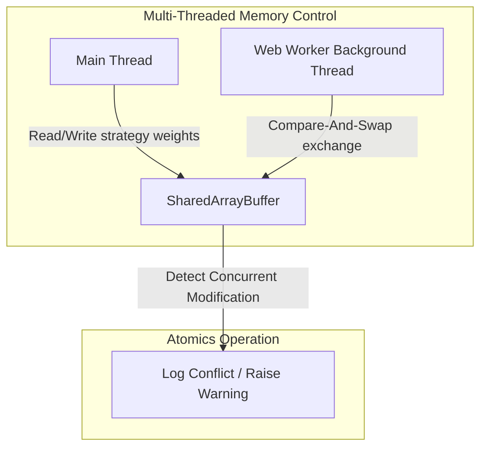
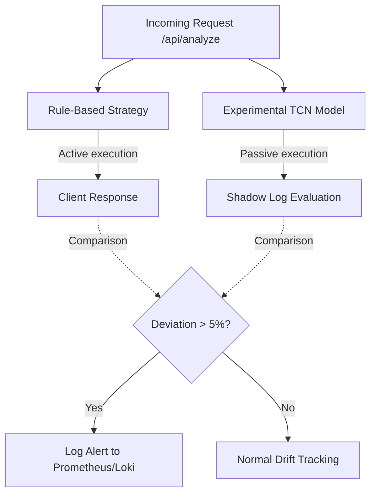

# Non-Deterministic Debugging & Distributed Tracing Strategy

This document outlines the architectural patterns, monitoring setups, and diagnostic queries used to trace, identify, and resolve race conditions, Heisenbugs, and performance bottlenecks across the Intelligences-Trader ecosystem.

---

## 🏛 Concurrency & Race Condition Detection

To coordinate state and analyze multi-timeframe market data concurrently, the terminal offloads calculations to background threads. We implement strict safeguards to detect and prevent race conditions.



- **SharedArrayBuffer & Atomics:** A shared memory block is used to store strategy state (e.g. model weights, execution thresholds). Background Web Workers and the Main Thread synchronize access using `Atomics.compareExchange` to verify state consistency before updates.
- **Conflict Warning:** If a concurrent modification is detected (i.e. the value changed unexpectedly between read and write operations), the system logs a high-priority warning and falls back to a safe backup copy.

---

## 🔬 Shadow Mode Protocol

The Shadow Mode Protocol evaluates experimental models against live production data streams without risking capital or blocking hot-path execution.



- **Execution Flow:** In the `/api/analyze` request pipeline, the rule-based execution engine serves the live traffic while the experimental Temporal Convolutional Network (TCN) processes the same payload asynchronously in a background thread.
- **Drift Evaluation:** The system computes the prediction delta between the live ruleset and the shadow model. A deviation exceeding `5%` triggers an alert, signifying potential model misalignment or code divergence.

---

## 🪵 Correlation IDs & Structured Logging

We use a correlation middleware to trace execution spans across services.
- **Express Middleware:** Injects a unique `x-correlation-id` header into every incoming request.
- **Propagating Context:** This ID is forwarded to child processes, database sessions, and inside the **ONNX Runtime Session** (via `RunOptions.logId`).
- **Pino Logger:** Under high loads, logging is adjusted to level-based buffering to prevent blocking main loop cycles.

---

## 📊 Grafana Monitoring (PromQL Queries)

Here are the 6 critical PromQL queries used in Grafana to monitor the health and performance of the systems:

### 1. P99 WebSocket Latency
Measures the latency threshold below which 99% of real-time WebSocket tick updates are pushed to the UI:
```promql
histogram_quantile(0.99, sum(rate(websocket_request_duration_seconds_bucket[5m])) by (le))
```

### 2. ONNX Inference Error Rate
Tracks the ratio of failed ONNX model inferences to the total requested runs:
```promql
sum(rate(onnx_inference_errors_total[5m])) / sum(rate(onnx_inference_requests_total[5m]))
```

### 3. Model Confidence Deviation (Shadow Mode)
Measures the average percentage deviation of the experimental TCN model's confidence output relative to the baseline ruleset:
```promql
avg_over_time(shadow_mode_confidence_deviation_percent[5m])
```

### 4. Web Worker Memory Growth Rate
Detects memory leaks in background analysis workers by tracking resident memory increases per second:
```promql
rate(process_resident_memory_bytes{job="web_worker"}[5m])
```

### 5. PPO Actor-Critic Exploration Stability (Entropy)
Monitors PPO Reinforcement Learning policy entropy to prevent premature policy convergence or collapse:
```promql
avg_over_time(ppo_actor_entropy[10m])
```

### 6. Expected Calibration Error (ECE)
Monitors the calibration of probabilities produced by the classification models to ensure predictions match real-world likelihoods:
```promql
rate(tcn_calibration_error_total[1h])
```

---

## 🔄 Retraining Pipeline Tracer

Retraining lifecycle events (triggered by concept drift) can be tracked in log aggregators (ELK, Loki) using:
```logql
{job="ai-backend"} |= "Retraining:"
```
This enables tracing a cycle from `Retraining: Data preparation...` through compilation to hot reload.

---

### 🇮🇷 خلاصه به فارسی
این سند استراتژی‌های اشکال‌زدایی غیرقطعی (Non-deterministic) پروژه را توضیح می‌دهد. 
1. **تشخیص Race Condition:** با کمک حافظه اشتراکی (`SharedArrayBuffer`) و توابع `Atomics` تداخل بین ترد اصلی و ورکرها مانیتور می‌شود.
2. **پروتکل Shadow Mode:** درخواست‌های تحلیلی بوسیله مدل آزمایشی در پس‌زمینه اجرا شده و با مدل لایو مقایسه می‌گردند تا انحراف بالای ۵ درصد گزارش شود.
3. **مانیتورینگ PromQL:** کوئری‌های کلیدی گافانا برای رصد Latency وب‌سوکت، خطاهای ONNX، لیک مموری ورکرها و پایداری اکتشاف PPO در این داکیومنت پیاده‌سازی و فرموله شده‌اند.
