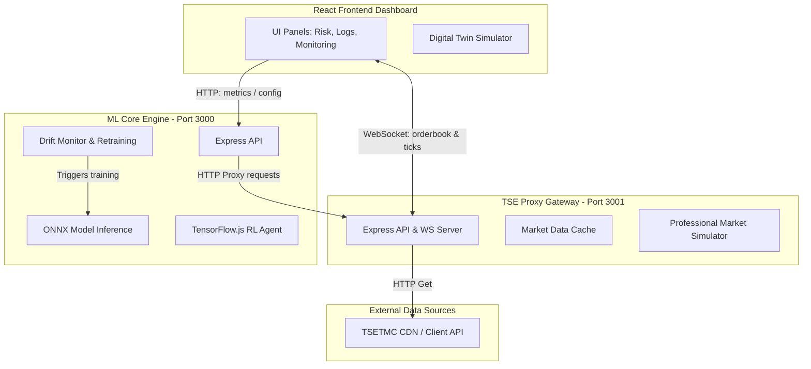

# Intelligences-Trader - System Roadmap & Documentation

Intelligences-Trader is an enterprise-grade automated algorithmic trading platform designed for high-frequency trading (HFT) and quantitative analysis on the Tehran Stock Exchange (TSETMC) and Iran Mercantile Exchange (IME). It couples a cybernetic React dashboard with an ONNX-backed Temporal Convolutional Network (TCN) ML engine and a resilient proxy gateway.

---

## 1. System Architecture

The following diagram details the data flow and communication protocols across the three main services:

---

## 2. Monorepo Service Modules

### 2.1. React Client Dashboard (`/robot trader`)
- **Interactive UI**: Custom trading terminals featuring real-time visualization of order book depth, market regime states, and active risk limits.
- **Risk Control Panel**: System-level emergency stop toggle, drawdowns configurator, and margin utilization thresholds.
- **System Health Monitor**: Visualizes API response latency, worker thread pool capacity, CPU/memory telemetry, and live execution traces.
- **Twin Simulation**: Leverages Merton Jump Diffusion to simulate market data locally if the live proxy goes offline.

### 2.2. ML Core Engine (`/robot trader/server`)
- **Temporal Convolutional Network (TCN)**: Multi-layer causal convolutions with dilation for high-accuracy market direction prediction.
- **Shadow Mode Protocol**: Runs ONNX model inferences in parallel with classical rule-based engines, logging significant predictions discrepancies without blocking the trading execution path.
- **Reinforcement Learning (PPO)**: TensorFlow.js continuous actor-critic agent for dynamic Kelly portfolio fraction sizing.
- **Drift & Retraining Loop**: Monitors validation calibration error and triggers automated model updates when data distribution changes.

### 2.3. TSE Proxy Gateway (`/server`)
- **High-Frequency Streaming**: Broadcasts order book, trade ticks, and price feeds at 100ms intervals over WebSockets (<50ms latency).
- **Fallback Simulation**: Emulates realistic Iranian IRR market parameters (limit up/down restrictions, volume distribution) in case of CDN failures.
- **Telemetry**: OpenTelemetry tracing hooks and Prometheus scraping endpoints for standard SRE monitoring.

---

## 3. Project Roadmap & Development Phases

### Phase 1: Foundations & Core Connectivity (Completed)
- Establish Express.js servers with CORS, rate-limiting, and OpenTelemetry instrumentation.
- Connect proxy endpoints to TSETMC CDN APIs.

### Phase 2: Quantitative Engines & ML Models (Completed)
- Implement fractional differentiation algorithms to preprocess non-stationary price series.
- Construct the ONNX-based TCN classifier with purged K-Fold cross-validation.
- Deploy the continuous PPO Reinforcement Learning agent.

### Phase 3: Premium UI Dashboard (Completed)
- Implement dashboard panels (Risk limits, audit logs, system monitor, connection gateway settings).
- Integrate custom tailwind hooks, mesh designs, and interactive charts.

### Phase 4: GitOps & CI/CD Optimization (Completed)
- Fix container healthcheck checks in `docker-compose.yml` to target `/api/status`.
- Optimize GitHub Action runner times by migrating to single-pass npm workspace dependencies installation.
- Correct docker image signing by lowercasing repository parameters in Cosign steps.

---

## 4. Next Steps & Future Phases

### Phase 5: Production Sandbox Testing (Current Phase)
- Execute end-to-end integration tests of the Docker Compose stack.
- Simulating network failures and checking if the client transitions cleanly into Merton simulation mode.
- Validating health checks and telemetry metrics collectors.

### Phase 6: Live Brokerage Integration (Next Phase)
- Integrate with local broker protocols (Tadbir, Rayan, or OMS endpoints) to handle live order placement.
- Implement transactional state machines to recover orders after unexpected network disconnections.
- Add OAuth2/JWT secure handshakes for live trading sessions.

### Phase 7: Distributed Reinforcement Learning
- Scale model training to run distributed training over historical market datasets using Ray or Spark.
- Implement adversarial market-maker agents in the simulation layer to train the PPO agent under stress.

### Phase 8: Advanced Backtester & Risk Simulator
- Build a discrete-event backtesting system that simulates trade fills under orderbook queue position delays.
- Implement Monte Carlo simulation parameters for historical stress-testing.
