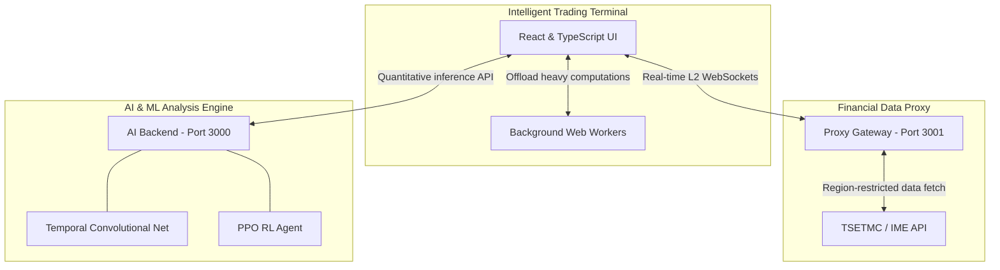

# Intelligences-Trader: Professional IME Algorithmic Trading Ecosystem


An end-to-end, high-frequency algorithmic trading and analysis ecosystem specifically engineered for the **Iran Mercantile Exchange (IME)**. This project integrates advanced AI architectures, robust risk management, and a high-performance modular frontend to deliver institutional-grade market insights and execution.

---

## 🏛 System Architecture

The ecosystem consists of three primary layers structured to isolate data ingestion, quantitative inference, and terminal interaction:



### 1. **Advanced AI & ML Engine (`/robot trader/server`)**
A high-performance Node.js backend specialized in deep learning and quantitative analysis.
- **TCN (Temporal Convolutional Network):** Multi-timeframe sequence modeling with optimized **Focal Loss** and **Expected Calibration Error (ECE)** metrics for reliable classification.
- **RL (Reinforcement Learning):** A **PPO (Proximal Policy Optimization)** agent with **Entropy Bonus** for continuous action space sampling (Position Sizing).
- **Ensemble Controller:** Dynamic weighting mechanism using **Softmax Attention** and **Adaptive Temperature Scaling** based on historical model performance.
- **Federated Learning:** Simulated decentralized training using **FedAvg** with **Differential Privacy (Gaussian Noise)** and momentum-based client updates.
- **Explainable AI (XAI):** Mathematically grounded **SHAP** (Shapley Additive Explanations) and **LIME** (Local Interpretable Model-agnostic Explanations) for model transparency.
- **HPO (Hyperparameter Optimization):** Automated tuning using a simulated **TPE (Tree-structured Parzen Estimator)** algorithm.

### 2. **Data Proxy & Real-time Streamer (`/server`)**
A resilient gateway to financial data providers.
- **TSETMC/IME Integration:** Overcomes CORS and regional restrictions to provide real-time market snapshots.
- **WebSocket Streaming:** Low-latency push updates for Order Books (L2) and Trade Ticks.
- **Shadow Mode Protocol:** Parallel execution of experimental models against production rules for performance delta analysis.

### 3. **Intelligent Trading Terminal (`/robot trader`)**
A modular, high-performance React dashboard designed for professional traders.
- **Custom Hook Architecture:** Specialized logic separation (`useMarketData`, `useWebSocket`, `useLocalStorage`).
- **L2 Order Book Visualization:** Real-time depth analysis with **Spoofing Detection** and herding behavior indicators.
- **Macro Covariate Tracking:** Correlation mapping between Global Commodities (Gold, Copper, Brent) and local USD rates.
- **NLP Sentiment Engine:** Integrated **ParsBERT**-inspired analysis for extracting political risk and mercantile sentiment from official news streams.

---

## 🚀 Key Features

- **Risk Management Engine:** Adaptive Kelly Criterion, Saf Hamle (Limit Up/Down) detection, and dynamic margin requirement scaling.
- **Arbitrage Scanner:** Real-time detection of **Cash & Carry**, **Basis**, and **Inter-market** opportunities.
- **Concept Drift Detection:** Monitoring model uncertainty via prediction entropy with automatic retraining triggers.
- **Digital Twin Simulation:** High-fidelity market generation using **Merton Jump Diffusion** and Geometric Brownian Motion for offline testing.

---

## 🛠 Installation & Setup

### Prerequisites
- Node.js v18+
- Hardware supporting `SharedArrayBuffer` (for multi-threaded worker analysis)

### Step 1: Data Proxy Server
```bash
cd server
npm install
npm start
```
> [!NOTE]
> The Data Proxy Server runs on `http://localhost:3001` by default.

### Step 2: AI Analysis Backend
```bash
cd "robot trader/server"
npm install
npm start
```
> [!NOTE]
> The AI Analysis Backend runs on `http://localhost:3000` by default.

### Step 3: Frontend Terminal
```bash
cd "robot trader"
npm install
npm run dev
```
> [!NOTE]
> The Trading Terminal runs on `http://localhost:5173` by default.

---

## 🧪 Testing & Validation

The system includes a comprehensive test suite for both AI models and trading logic.

```bash
# Run tests across all workspaces (Monorepo root)
npm test --workspaces --if-present

# To run AI/Server tests specifically
cd "robot trader/server"
npm test

# To run E2E/Audit tests specifically
cd "robot trader"
npm test
```

---

## 📜 Documentation Reference
- [Debugging Strategy](./DEBUGGING_STRATEGY.md): Non-deterministic debugging, Atomics, and PromQL monitoring.
- [AI Engine Details](./robot%20trader/server/README.md): In-depth look at model architectures and mathematical formulations.

---

## ⚠️ Disclaimer
This software is provided for **educational and research purposes only**. Financial trading involves significant risk. The developers are not responsible for any financial losses incurred through the use of this software.

---

### 🇮🇷 خلاصه به فارسی
این پروژه یک اکوسیستم کامل برای معاملات الگوریتمی در **بورس کالای ایران** است. سیستم شامل مدل‌های پیشرفته هوش مصنوعی (TCN, PPO, Federated Learning)، مانیتورینگ لحظه‌ای تابلو (L2) با تشخیص دستکاری بازار (Spoofing)، و موتور مدیریت ریسک حرفه‌ای است که محدودیت‌های دامنه نوسان و سررسید قراردادها را به طور هوشمند مدیریت می‌کند. ساختار جدید پروژه با استفاده از معماری ماژولار در فرانت‌اند و بک‌اندهای تخصصی، پایداری و دقت بالایی را برای تحلیل‌گران فراهم می‌آورد.
