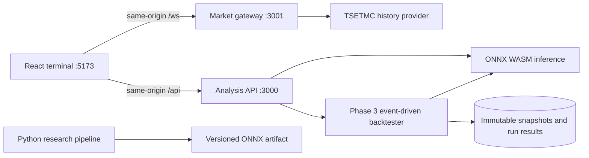

# Intelligences-Trader

A research and simulation platform for Iranian commodity-market analytics. The repository combines a React terminal, a Node.js analysis service, a market-data/WebSocket gateway, and a Python PPO/TCN research pipeline.

> **Important:** this is not a production brokerage or high-frequency execution system. It does not place live orders. Generated candles, simulated order books, macro values, and experimental engines are labelled research/demo data and must not be used as verified exchange data.

## Architecture



| Area | Path | Purpose |
|---|---|---|
| Terminal | `robot trader/` | Dashboard, risk controls, indicators, backtesting, worker pool |
| Analysis API | `robot trader/server/` | Rule analysis, model inference, research training endpoints |
| Gateway | `server/` | TSETMC history adapter, explicitly labelled fallback simulation, WebSocket feed |
| Python ML | `ml_service/` | TCN actor-critic, PPO training, HMM regimes, safety circuit breaker |

The frontend uses relative `/api` and `/ws` URLs. Vite proxies these routes during development, while the production Nginx template proxies them inside Docker/Kubernetes. Browser code does not depend on `localhost` service URLs.

## Quick start

### Node services and terminal

Requirements: Node.js 22 and npm 10+.

```bash
npm ci
npm run typecheck
npm test --workspaces --if-present
npm run build
npm run test:e2e:install --workspace app
npm run test:e2e --workspace app
```

The browser suite starts all three services automatically and checks desktop,
mobile, API navigation, and WebSocket reconnect behavior. Run the three
processes manually in separate shells when developing: in separate shells:

```bash
npm start --workspace tse-proxy-server
npm start --workspace server
npm run dev --workspace app
```

Open `http://localhost:5173`. Digital-twin fallback is enabled in the default client configuration so the research UI remains usable when TSETMC is unavailable. The UI settings can disable it.

### Python ML checks

Requirements: Python 3.11+ and [uv](https://docs.astral.sh/uv/).

```bash
cd ml_service
uv sync --locked
uv run pytest -q
```

Reproduce the integrated 3-symbol × 3-strategy backtest, comparison CSV,
Markdown report, and equity/drawdown PNGs:

```bash
uv run python run_backtests.py
```

See [`ml_service/backtest_report.md`](./ml_service/backtest_report.md) for the
measured results and data/model provenance.

Training dependencies are optional because PyTorch/ONNX are large:

```bash
uv sync --locked --extra training
uv run python train.py
```

## Docker Compose

```bash
cp .env.example .env
# Keep NODE_ENV=development for a local-only research instance.
docker compose up --build
```

Only the frontend is exposed on port 5173; it reverse-proxies the internal
analysis, market, Redis, and PostgreSQL services. Set `PUBLIC_ORIGIN` when the
browser origin differs from `http://localhost:5173`.

Authentication protects every `/api` route except `/api/status`, login, and
refresh when enabled. It defaults to enabled whenever `NODE_ENV=production` and
`AUTH_REQUIRED` is left unset. Shared/staging/production deployments must use
secret-manager values rather than `.env`:

```bash
NODE_ENV=production \
AUTH_REQUIRED=true \
JWT_SECRET='at-least-32-random-characters' \
REFRESH_SECRET='another-32-character-random-value' \
ADMIN_USERNAME='admin' \
ADMIN_PASSWORD='use-a-secret-manager' \
docker compose up --build
```

The terminal's API Configuration screen can obtain a short-lived access token
from `/api/auth/login`; both access and refresh tokens stay in session storage and are not persisted to local storage. Never commit
credentials. To generate strong values for every secret in one step:

```bash
bash scripts/generate-secrets.sh --write   # merges into the gitignored .env
```

Experimental ensemble/federated/HPO simulations return HTTP 501
unless `ENABLE_EXPERIMENTAL_SIMULATIONS=true` is explicitly set.

## Troubleshooting

**macOS: `Cannot find module '@rollup/rollup-darwin-arm64'` / `@esbuild/darwin-arm64` /
`lightningcss-darwin-arm64` / `@tailwindcss/oxide-darwin-arm64` during `vite build`.**
npm bug [#4828](https://github.com/npm/cli/issues/4828): lockfiles resolved on
one platform omit other platforms' optional binaries. One-off local fix:

```bash
npm install --no-save \
  @rollup/rollup-darwin-arm64 @esbuild/darwin-arm64 \
  lightningcss-darwin-arm64 @tailwindcss/oxide-darwin-arm64
```

## Validation and safety improvements

- Stateful drawdown tracking and a sticky kill switch; balance updates no longer recreate the risk engine.
- Position sizing is capped by both fractional Kelly risk and maximum notional exposure.
- WebSocket payload validation, order-book normalization, bounded reconnect backoff, heartbeat, and backpressure handling.
- Strict OHLCV/model-input validation and honest out-of-sample metrics (no hard-coded performance floors).
- Causal TCN convolutions and consistent PPO direction encoding (`0=short`, `1=hold`, `2=long`).
- HMM short-history fallback, finite-value checks, authenticated AES-256-GCM secret encryption, rate limits, CORS allowlists, and request-size limits.
- Reproducible root lockfile, zero npm audit findings, verified Python test commands, and deterministic Docker workspace builds.
- Empty ledgers stay empty; generated market/order-book/news values and all paper outcomes carry explicit simulation provenance.
- Global optional API authentication, strict Bearer parsing, login throttling, timing-safe credential comparison, security headers, CSP, and non-root containers.
- Real browser E2E specifications no longer swallow failures or use placeholder assertions.

See [`FULL_STACK_AUDIT_REPORT.md`](./FULL_STACK_AUDIT_REPORT.md) for the current
principal-engineering audit, [`AUDIT_REPORT.md`](./AUDIT_REPORT.md) for the detailed audit, fixes, and remaining limitations,
and [`GAP_ANALYSIS_2026-08-24.md`](./GAP_ANALYSIS_2026-08-24.md) for the latest full-stack gap review and remediation log.

## API highlights

- Analysis: `GET /api/status`, `POST /api/analyze`, `POST /api/predict`, `POST /api/train`
- Gateway: `GET /api/status`, `GET /api/market/:symbol`, `GET /api/orderbook/:symbol`
- Streaming: `ws://host/ws?symbol=GOLD-FUT`
- Metrics: `GET /metrics` on both Node services

### Phase 3 Backtesting endpoints

- Datasets: `POST /api/backtests/datasets`, `GET /api/backtests/datasets/:datasetId`
- Health and runs: `GET /api/backtests/health`, `POST|GET /api/backtests`, `GET /api/backtests/:runId`, `POST /api/backtests/:runId/cancel`
- Results: `GET /api/backtests/:runId/results`, `GET /api/backtests/:runId/artifacts/:name`
- Comparison: `POST /api/backtests/compare`

The engine requires immutable dataset snapshots, uses next-bar point-in-time execution, supports pinned ONNX models and deterministic market scenarios, and derives PnL only from fills. See [`PHASE3_CHANGES.md`](./PHASE3_CHANGES.md).

### P2 Paper-Trading endpoints

- Execution & ML: `POST /api/paper-trading/p2/execute-ml`, `POST /api/paper-trading/p2/strategy`
- Analytics: `GET /api/paper-trading/p2/metrics`, `POST /api/paper-trading/p2/report`
- Backtest: `POST /api/paper-trading/p2/backtest`
- Order book: `GET|POST /api/paper-trading/p2/orderbook`, `POST /api/paper-trading/p2/orderbook/order|cancel`
- Order state machine: `GET|POST /api/paper-trading/p2/orders`, `POST /api/paper-trading/p2/orders/cancel|fill`
- Data feed: `POST /api/paper-trading/p2/data/ohlcv`, `GET|POST /api/paper-trading/p2/data/tick`
- Persistence: `POST /api/paper-trading/p2/trades/save`, `GET /api/paper-trading/p2/trades`

See [`PHASE2_CHANGES.md`](./PHASE2_CHANGES.md) for the Phase 2 build-out details.

## Backtesting architecture

The implemented Phase 3 event-driven backtesting design—including the Mermaid architecture, component boundaries, Phase 1 data integration, ML model contract, market scenarios, execution semantics, and performance metrics—is documented in [`docs/BACKTESTING_ENGINE_ARCHITECTURE.md`](./docs/BACKTESTING_ENGINE_ARCHITECTURE.md).

## Disclaimer

Educational and research use only. Financial markets involve substantial risk. Validate data licenses, model provenance, exchange rules, security controls, and broker behavior independently before considering any real-world integration.
