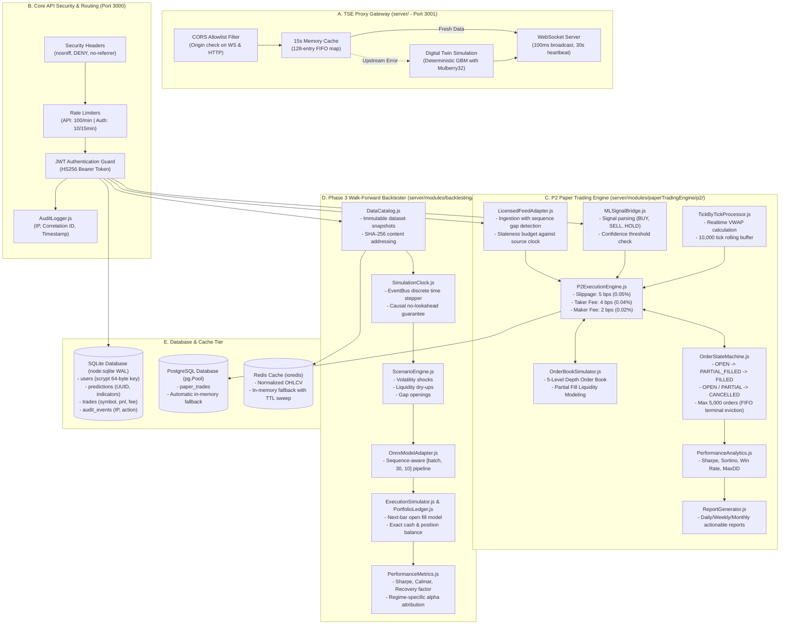
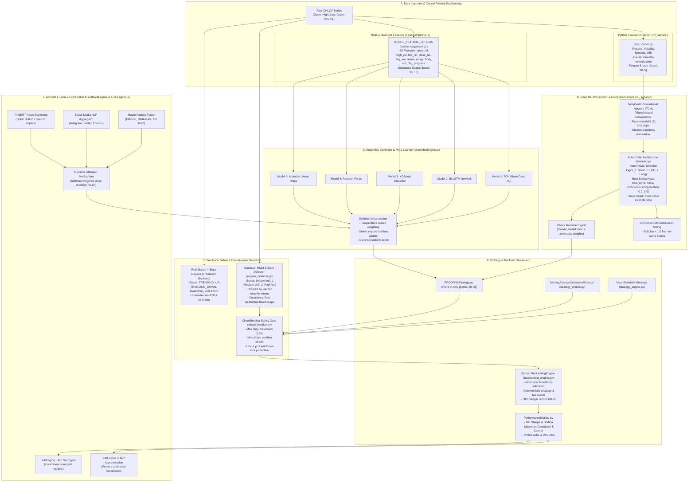

# Intelligences-Trader

A research and simulation platform for Iranian commodity-market analytics. The repository combines a React terminal, a Node.js analysis service, a market-data/WebSocket gateway, and a Python PPO/TCN research pipeline.

> **Important:** this is not a production brokerage or high-frequency execution system. It does not place live orders. Generated candles, simulated order books, macro values, and experimental engines are labelled research/demo data and must not be used as verified exchange data.

## System Architecture & Dataflow Graphs

### 1. Master System Topology & Execution Lifecycle

```mermaid
flowchart TB
    subgraph External_World ["1. External Market & Regulatory Feeds"]
        TSETMC_CDN["TSETMC Exchange CDN\n(cdn.tsetmc.com)"]
        MACRO_FEEDS["Macro & Commodity Feeds\n(USD Free, NIMA, Gold, Oil)"]
        NEWS_FEEDS["NLP Financial News\n& Geopolitical Feeds"]
        CCXT_EXCHANGES["CCXT Spot/Futures Exchanges\n(ccxtAdapter.js)"]
    end

    subgraph Edge_Gateway ["2. Edge Proxy Gateway (server/ - Port 3001)"]
        PROXY_IN["Ingestion Controller\n& CORS / Security Headers"]
        MARKET_CACHE["15s FIFO Cache\n(128-entry capacity)"]
        DIGITAL_TWIN_SIM["Deterministic Digital Twin\n(Mulberry32 PRNG Fallback)"]
        WS_HUB["WebSocket Broadcast Server\n(100ms Tick / Depth Stream)"]
        WS_HEARTBEAT["Heartbeat Manager\n(30s Ping-Pong Sweep)"]
    end

    subgraph Core_Backend ["3. Intelligence & Paper Trading Backend (robot trader/server/ - Port 3000)"]
        REST_AUTH["Security Middleware\n(Rate Limiter & JWT Guard)"]
        
        subgraph Realtime_Intelligence ["Market Intelligence & Analysis"]
            RULE_ANALYZER["Rule-Based Strategy Engine\n(Synchronous <500ms SLA)"]
            TCN_SHADOW["TCN ONNX Shadow Runner\n(Async Drift Monitor >5%)"]
            MTF_ENGINE["MTF & Regime Detector\n(ATR, VaR-95, Ichimoku)"]
        end

        subgraph Paper_Engine_P2 ["P2 Paper Trading & Execution"]
            FEED_ADAPTER["LicensedFeedAdapter.js\n(Sequence & Staleness Guard)"]
            ML_BRIDGE["MLSignalBridge\n(Confidence & Threshold Filter)"]
            ORDER_BOOK_SIM["OrderBookSimulator\n(5-Level Depth, Market/Limit)"]
            ORDER_SM["OrderStateMachine\n(OPEN->PARTIAL->FILLED/CANCEL)"]
            EXEC_ENGINE["P2ExecutionEngine\n(Slippage 5bps, Fees 2-4bps)"]
            TICK_PROC["TickByTickProcessor\n(Realtime VWAP & 10k Buffer)"]
        end

        subgraph Phase3_Backtesting ["Phase 3 Walk-Forward Backtester"]
            DATA_CATALOG["Immutable DataCatalog\n(SHA-256 Snapshots)"]
            SIM_CLOCK["SimulationClock & EventBus\n(Point-in-Time Causal Replay)"]
            SCENARIO_ENG["ScenarioEngine\n(Vol Shock, Trend, Gap, Slippage)"]
            PERF_METRICS["PerformanceMetrics\n(Sharpe, Sortino, Drawdown, PF)"]
        end

        subgraph Storage_Layer ["Durable Persistence & Cache"]
            SQLITE_DB[("SQLite Database (node:sqlite)\nUsers, Predictions, Trades, Audit")]
            PG_REPO[("PostgreSQL / In-Memory Repo\n(FIFO Capped at 5,000 Trades)")]
            REDIS_LAYER[("Redis / In-Memory Cache\n(Active TTL Sweep)")]
        end
    end

    subgraph Python_ML_Engine ["4. Python ML Service (ml_service/)"]
        PPO_ACTOR_CRITIC["PPO Actor-Critic Network\n(TCN Base + Beta Policy)"]
        HMM_REGIME["Gaussian HMM 3-State Detector\n(Low, Medium, High Volatility)"]
        PY_STRATEGY["StrategyEngine\n(MA Crossover, Mean Reversion)"]
        PY_BACKTEST["Integrated BacktestingEngine\n(Exact Ledger Reconciliation)"]
        CIRCUIT_BREAKER["CircuitBreaker Safety Layer\n(Max 3% Daily DD, Max 20% Pos)"]
    end

    subgraph Frontend_Terminal ["5. Frontend Terminal (robot trader/src/)"]
        subgraph Custom_Hooks ["Reactive Orchestrators & Hooks"]
            HOOK_MARKET["useMarketData Hook\n(Polling, Workers, Training)"]
            HOOK_WS["useWebSocket Hook\n(Reconnect Backoff, Tick Buffer)"]
            HOOK_API_CONF["useApiConfig & useLocalStorage\n(Persistence & Settings)"]
        end

        subgraph Web_Worker_Pool ["Multithreaded Worker Pool (src/workers/)"]
            W_POOL["WorkerPool (N Concurrency)"]
            W_ANALYZER["marketAnalyzer.worker\n(MTF Analysis & Backtest)"]
        end

        subgraph UI_Components ["Trading Terminal UI"]
            APP_SHELL["AppShell.tsx Layout\n(Header, Sidebar, BottomNav, StatusBar)"]
            PRO_CHART["ProfessionalChart.tsx\n(SVG Candles, Depth, Indicators)"]
            TRADE_TICKET["TradeTicket.tsx Modal\n(2-Step Confirmation, IRR)"]
            RISK_PANEL["RiskControlPanel.tsx\n(Kelly Gauge, Margin Limits)"]
            PAPER_DASH["FullPaperTradingDashboard.tsx\n(KPI Cards, Reports, PnL)"]
            BACKTEST_DASH["BacktestingDashboard.tsx\n(Walk-Forward Simulation)"]
            LEARNING_DASH["LearningDashboard.tsx\n(Meta-Weights & Calibration)"]
            SENTIMENT_MON["SentimentMonitor.tsx\n(Political Risk & News Sentiment)"]
            ORDER_BOOK_UI["OrderBook.tsx\n(Depth, Heatmap, Herding)"]
            CORRELATION_UI["MarketCorrelation.tsx\n(Cross-Asset Correlation Matrix)"]
            REGIME_UI["MarketRegimeTimeline.tsx\n(Regime Transition History)"]
            PERF_UI["PerformanceAnalytics.tsx\n(Institutional Ratio Deck)"]
        end
    end

    %% Ingestion & Streaming Connections
    TSETMC_CDN -->|Raw Instrument History| PROXY_IN
    CCXT_EXCHANGES -->|Normalized REST| FEED_ADAPTER
    PROXY_IN --> MARKET_CACHE
    MARKET_CACHE -->|Cache Hit <15s| WS_HUB
    MARKET_CACHE -.->|Timeout / Error Fallback| DIGITAL_TWIN_SIM
    DIGITAL_TWIN_SIM --> WS_HUB
    WS_HUB --> WS_HEARTBEAT
    WS_HUB ==>|100ms WS Streaming| HOOK_WS

    %% Frontend Hook & Worker Interconnects
    HOOK_WS --> APP_SHELL
    HOOK_MARKET --> W_POOL
    W_POOL <--> W_ANALYZER
    HOOK_MARKET --> APP_SHELL
    HOOK_API_CONF --> APP_SHELL

    %% Terminal UI Rendering
    APP_SHELL --> PRO_CHART
    APP_SHELL --> TRADE_TICKET
    APP_SHELL --> RISK_PANEL
    APP_SHELL --> PAPER_DASH
    APP_SHELL --> BACKTEST_DASH
    APP_SHELL --> LEARNING_DASH
    APP_SHELL --> SENTIMENT_MON
    APP_SHELL --> ORDER_BOOK_UI
    APP_SHELL --> CORRELATION_UI
    APP_SHELL --> REGIME_UI
    APP_SHELL --> PERF_UI

    %% UI to Backend REST
    TRADE_TICKET ==>|POST /api/paper-trading/execute| REST_AUTH
    PAPER_DASH ==>|POST /api/paper-trading/p2/execute-ml| REST_AUTH
    RISK_PANEL ==>|POST /api/paper-trading/p2/strategy| REST_AUTH
    APP_SHELL ==>|POST /api/analyze| REST_AUTH

    %% Backend Intelligence Flow
    REST_AUTH --> RULE_ANALYZER
    RULE_ANALYZER --> MTF_ENGINE
    RULE_ANALYZER -.->|Shadow Mode Check| TCN_SHADOW
    REST_AUTH --> NLP_NEWS
    NEWS_FEEDS --> NLP_NEWS

    %% Paper Trading Lifecycle
    REST_AUTH --> ML_BRIDGE
    FEED_ADAPTER --> EXEC_ENGINE
    ML_BRIDGE --> EXEC_ENGINE
    EXEC_ENGINE <--> ORDER_BOOK_SIM
    EXEC_ENGINE <--> ORDER_SM
    TICK_PROC --> EXEC_ENGINE
    EXEC_ENGINE --> PG_REPO
    REST_AUTH --> SQLITE_DB

    %% Backtesting Lifecycle
    REST_AUTH --> DATA_CATALOG
    DATA_CATALOG --> SIM_CLOCK
    SIM_CLOCK --> SCENARIO_ENG
    SCENARIO_ENG --> PERF_METRICS

    %% Python ML Engine Bridge
    TCN_SHADOW <-->|ONNX Export / Weights| PPO_ACTOR_CRITIC
    MTF_ENGINE <-->|Regime Priors| HMM_REGIME
    PY_STRATEGY --> CIRCUIT_BREAKER
    CIRCUIT_BREAKER --> PY_BACKTEST
```



---

### 2. Specialized Frontend Architecture & UI State Engine

```mermaid
flowchart TD
    subgraph UI_State_Hierarchy ["A. React Component Hierarchy & Panels (src/components/)"]
        ROOT_APP["App.tsx (Root State Shell)"]
        APP_SHELL_LAYOUT["AppShell.tsx Layout Suite\n- Header (Status & Conn Badge)\n- Sidebar & MobileDrawer\n- BottomNav (Tab Switcher)\n- StatusBar (Latency & Sync)"]
        
        subgraph Tab_Views ["Main Navigation Views"]
            TAB_DASH["Dashboard View\n(Main Trading & Depth Interface)"]
            TAB_PAPER["Paper Trading View\n(FullPaperTradingDashboard.tsx)"]
            TAB_BACKTEST["Walk-Forward Backtesting View\n(BacktestingDashboard.tsx)"]
            TAB_LEARNING["Meta-Learning View\n(LearningDashboard.tsx)"]
            TAB_ARBITRAGE["Arbitrage Scanner View\n(ArbitragePanel.tsx)"]
            TAB_CORRELATION["Market Correlation View\n(MarketCorrelation.tsx)"]
            TAB_REGIME["Market Regime View\n(MarketRegimeTimeline.tsx)"]
            TAB_PERF["Performance Analytics View\n(PerformanceAnalytics.tsx)"]
        end

        subgraph Interactive_Modals ["Floating Overlays & Controls"]
            MODAL_TRADE["TradeTicket.tsx Modal\n(2-Step Trade Confirmation, IRR)"]
            PANEL_RISK["RiskControlPanel.tsx\n(Kelly Fraction Gauge & Margin)"]
            PANEL_SETTINGS["ApiSettingsPanel.tsx\n(Endpoint & JWT Configuration)"]
        end
    end

    subgraph Reactive_Hooks ["B. State Stores & Custom Hooks (src/hooks/)"]
        HOOK_MD["useMarketData.ts\n- candleData, mtfCandles\n- forecast, strategyWeights\n- trainingProgress\n- lastUpdated timestamp"]
        HOOK_WS["useWebSocket.ts\n- isConnected, isStale\n- orderBook, tradeTicks\n- reconnectBackoff (1s -> 30s)"]
        HOOK_API_CONF["useApiConfig.ts\n- proxyUrl, backendUrl, wsUrl\n- token storage & headers"]
        HOOK_STORAGE["useLocalStorage.ts\n- selectedSymbolId\n- userPreferences"]
    end

    subgraph Service_Singletons ["C. Services & Client Singletons (src/services/)"]
        PRED_SVC["PredictionHistoryService.ts\n- localStorage persistence\n- Pending prediction evaluator\n- Rolling 1,000 entry cap"]
        LEARN_ENG["LearningEngine.ts\n- Bayesian strategy weights\n- Win-rate confidence scalar\n- Adaptive bounds [0.5, 5.0]"]
        BACKEND_API["BackendApiService.ts\n- createBackendApi client\n- Typed positions, orders, paper trade calls"]
    end

    subgraph Client_Risk_Engine ["D. Client-Side Risk Architecture (src/riskEngine.ts)"]
        KELLY_CALC["Fractional Kelly Calculator\n(p - (1-p)/b) * 0.25"]
        VAR_CHECK["Value at Risk 95% Guard\n(Historical returns quantile)"]
        HOLIDAY_CALC["Iranian Calendar & Trading Session Guard\n(Jalali calendar + Thursday/Friday closure)"]
        MARGIN_CHECK["Maintenance Margin & Drawdown Guard\n(Liquidation distance & max exposure)"]
    end

    subgraph Multithreaded_Worker ["E. Web Worker Background Pipeline (src/workers/)"]
        W_MANAGER["workerPool.ts\n- Hardware concurrency scaling\n- FIFO task queue & auto-recovery\n- 30s task timeout with auto-restart"]
        W_TASK_MTF["Task: analyzeMarketMTF\n- SMA, EMA, MACD, RSI, ATR, BB\n- Ichimoku cloud (Tenkan, Kijun, Senkou)"]
        W_TASK_BT["Task: performWalkForwardBacktest\n- 60-candle rolling walk-forward test"]
        W_TASK_TR["Task: trainModelEpoch\n- In-browser TensorFlow.js training"]
    end

    subgraph Chart_Renderer ["F. Professional Chart Rendering Engine (ProfessionalChart.tsx)"]
        CHART_SVG["SVG Vector Canvas\n(ResizeObserver Dynamic Layout)"]
        SCALE_PRICE["Price Scale Engine\n(Auto-padding 4%, Bollinger, Stop/Target)"]
        SCALE_VOL["Volume Subpanel\n(Dynamic bar height & alpha)"]
        SCALE_OSC["RSI & MACD Subpanels\n(Layout A / B / C Modes)"]
        INTERACTION["Pan & Zoom Engine\n(Pointer capture, Crosshair tracker)"]
    end

    %% Component Wiring
    ROOT_APP --> APP_SHELL_LAYOUT
    ROOT_APP --> HOOK_MD
    ROOT_APP --> HOOK_WS
    ROOT_APP --> HOOK_API_CONF
    ROOT_APP --> HOOK_STORAGE

    HOOK_WS -->|Live Ticks & Depth| ROOT_APP
    HOOK_MD -->|Offload Heavy Analysis| W_MANAGER
    W_MANAGER --> W_TASK_MTF
    W_MANAGER --> W_TASK_BT
    W_MANAGER --> W_TASK_TR
    W_TASK_MTF -->|Analysis Result| HOOK_MD

    ROOT_APP --> TAB_DASH
    ROOT_APP --> TAB_PAPER
    ROOT_APP --> TAB_BACKTEST
    ROOT_APP --> TAB_LEARNING
    ROOT_APP --> TAB_ARBITRAGE
    ROOT_APP --> TAB_CORRELATION
    ROOT_APP --> TAB_REGIME
    ROOT_APP --> TAB_PERF

    TAB_DASH --> PRO_CHART
    TAB_DASH --> MODAL_TRADE
    TAB_DASH --> PANEL_RISK
    TAB_DASH --> PANEL_SETTINGS

    MODAL_TRADE --> KELLY_CALC
    MODAL_TRADE --> VAR_CHECK
    MODAL_TRADE --> HOLIDAY_CALC
    MODAL_TRADE --> MARGIN_CHECK

    PRO_CHART --> CHART_SVG
    CHART_SVG --> SCALE_PRICE
    CHART_SVG --> SCALE_VOL
    CHART_SVG --> SCALE_OSC
    CHART_SVG --> INTERACTION

    HOOK_MD --> PRED_SVC
    PRED_SVC --> LEARN_ENG
    LEARN_ENG -->|Updated Weights| HOOK_MD
    ROOT_APP --> BACKEND_API
```



---

### 3. Specialized Backend API, Proxy Gateway & P2 Paper Trading



---

### 4. Specialized AI/ML & Deep Reinforcement Learning Pipeline



---

## Codebase Topology & Core Hubs

| Subsystem Area | Directory Path | Core Purpose & Technical Scope |
|---|---|---|
| **Terminal UI** | `robot trader/` | React 19 SPA, SVG charts, Kelly fractional sizing, Web Worker pool |
| **Analysis & Backtesting** | `robot trader/server/` | Rule-based engine, ONNX WASM inference, P2 paper engine, Phase 3 backtester |
| **Proxy Gateway** | `server/` | TSETMC history cache (15s FIFO), WebSocket 100ms broadcaster, heartbeat |
| **Python ML Research** | `ml_service/` | TCN causal actor-critic, Beta continuous sizing, Gaussian HMM, CircuitBreaker |
| **Knowledge Graph** | `graphify-out/` | Graphify structural AST graph (1,546 nodes, 2,798 edges, 111 communities) |

The frontend communicates with relative `/api` and `/ws` endpoints. Vite proxies these routes during development, while the production Nginx container proxies them in production. Continuous testing covers 221 unit and integration test suites with 100% pass rate.


## Quick start

### Node services and terminal

Requirements: Node.js 22.13+ (uses the built-in `node:sqlite` module) and npm 10+.

```bash
npm ci
npm run typecheck
npm test --workspaces --if-present
npm run build
npm run test:e2e:install --workspace app
npm run test:e2e --workspace app
```

The browser suite starts all three services automatically and checks desktop,
mobile, API navigation, and WebSocket reconnect behavior. Run the three
processes manually in separate shells when developing: in separate shells:

```bash
npm start --workspace tse-proxy-server
npm start --workspace server
npm run dev --workspace app
```

Open `http://localhost:5173`. Digital-twin fallback is enabled in the default client configuration so the research UI remains usable when TSETMC is unavailable. The UI settings can disable it.

### Python ML checks

Requirements: Python 3.11+ and [uv](https://docs.astral.sh/uv/).

```bash
cd ml_service
uv sync --locked
uv run pytest -q
```

Reproduce the integrated 3-symbol × 3-strategy backtest, comparison CSV,
Markdown report, and equity/drawdown PNGs:

```bash
uv run python run_backtests.py
```

See [`ml_service/backtest_report.md`](./ml_service/backtest_report.md) for the
measured results and data/model provenance.

Training dependencies are optional because PyTorch/ONNX are large:

```bash
uv sync --locked --extra training
uv run python train.py
```

## Docker Compose

```bash
cp .env.example .env
# Keep NODE_ENV=development for a local-only research instance.
docker compose up --build
```

Only the frontend is exposed on port 5173; it reverse-proxies the internal
analysis, market, Redis, and PostgreSQL services. Set `PUBLIC_ORIGIN` when the
browser origin differs from `http://localhost:5173`.

Authentication protects every `/api` route except `/api/status`, login, and
refresh when enabled. It defaults to enabled whenever `NODE_ENV=production` and
`AUTH_REQUIRED` is left unset. Shared/staging/production deployments must use
secret-manager values rather than `.env`:

```bash
NODE_ENV=production \
AUTH_REQUIRED=true \
JWT_SECRET='at-least-32-random-characters' \
REFRESH_SECRET='another-32-character-random-value' \
ADMIN_USERNAME='admin' \
ADMIN_PASSWORD='use-a-secret-manager' \
docker compose up --build
```

The terminal's API Configuration screen can obtain a short-lived access token
from `/api/auth/login`; both access and refresh tokens stay in session storage and are not persisted to local storage. Never commit
credentials. To generate strong values for every secret in one step:

```bash
bash scripts/generate-secrets.sh --write   # merges into the gitignored .env
```

Experimental ensemble/federated/HPO simulations return HTTP 501
unless `ENABLE_EXPERIMENTAL_SIMULATIONS=true` is explicitly set.

## Troubleshooting

**`Cannot find module '@rollup/rollup-<platform>'` / `@esbuild/<platform>` /
`lightningcss-<platform>` / `@tailwindcss/oxide-<platform>` during `vite build`.**
npm bug [#4828](https://github.com/npm/cli/issues/4828): a lockfile resolved on
one platform may omit other platforms' optional binaries. The committed lockfile
was regenerated to include every platform's entries, so `npm ci` alone should
work everywhere. If you ever see the error again after dependency changes,
regenerate rather than patch:

```bash
rm -rf node_modules package-lock.json && npm install
```

## Validation and safety improvements

- Stateful drawdown tracking and a sticky kill switch; balance updates no longer recreate the risk engine.
- Position sizing is capped by both fractional Kelly risk and maximum notional exposure.
- WebSocket payload validation, order-book normalization, bounded reconnect backoff, heartbeat, and backpressure handling.
- Strict OHLCV/model-input validation and honest out-of-sample metrics (no hard-coded performance floors).
- Causal TCN convolutions and consistent PPO direction encoding (`0=short`, `1=hold`, `2=long`).
- HMM short-history fallback, finite-value checks, authenticated AES-256-GCM secret encryption, rate limits, CORS allowlists, and request-size limits.
- Reproducible root lockfile, zero npm audit findings, verified Python test commands, and deterministic Docker workspace builds.
- Empty ledgers stay empty; generated market/order-book/news values and all paper outcomes carry explicit simulation provenance.
- Global optional API authentication, strict Bearer parsing, login throttling, timing-safe credential comparison, security headers, CSP, and non-root containers.
- Real browser E2E specifications no longer swallow failures or use placeholder assertions.

See [`FULL_STACK_AUDIT_REPORT.md`](./FULL_STACK_AUDIT_REPORT.md) for the current
principal-engineering audit, [`AUDIT_REPORT.md`](./AUDIT_REPORT.md) for the detailed audit, fixes, and remaining limitations,
and [`GAP_ANALYSIS_2026-08-24.md`](./GAP_ANALYSIS_2026-08-24.md) for the latest full-stack gap review and remediation log.

## API highlights

- Analysis: `GET /api/status`, `POST /api/analyze`, `POST /api/predict`, `POST /api/train`
- Gateway: `GET /api/status`, `GET /api/market/:symbol`, `GET /api/orderbook/:symbol`
- Streaming: `ws://host/ws?symbol=GOLD-FUT`
- Metrics: `GET /metrics` on both Node services

### Phase 3 Backtesting endpoints

- Datasets: `POST /api/backtests/datasets`, `GET /api/backtests/datasets/:datasetId`
- Health and runs: `GET /api/backtests/health`, `POST|GET /api/backtests`, `GET /api/backtests/:runId`, `POST /api/backtests/:runId/cancel`
- Results: `GET /api/backtests/:runId/results`, `GET /api/backtests/:runId/artifacts/:name`
- Comparison: `POST /api/backtests/compare`

The engine requires immutable dataset snapshots, uses next-bar point-in-time execution, supports pinned ONNX models and deterministic market scenarios, and derives PnL only from fills. See [`PHASE3_CHANGES.md`](./PHASE3_CHANGES.md).

### P2 Paper-Trading endpoints

- Execution & ML: `POST /api/paper-trading/p2/execute-ml`, `POST /api/paper-trading/p2/strategy`
- Analytics: `GET /api/paper-trading/p2/metrics`, `POST /api/paper-trading/p2/report`
- Backtest: `POST /api/paper-trading/p2/backtest`
- Order book: `GET|POST /api/paper-trading/p2/orderbook`, `POST /api/paper-trading/p2/orderbook/order|cancel`
- Order state machine: `GET|POST /api/paper-trading/p2/orders`, `POST /api/paper-trading/p2/orders/cancel|fill`
- Data feed: `POST /api/paper-trading/p2/data/ohlcv`, `GET|POST /api/paper-trading/p2/data/tick`
- Persistence: `POST /api/paper-trading/p2/trades/save`, `GET /api/paper-trading/p2/trades`

See [`PHASE2_CHANGES.md`](./PHASE2_CHANGES.md) for the Phase 2 build-out details.

### Database & Authentication

The backend ships a zero-native-dependency SQLite persistence layer
(`node:sqlite`, Node 22.13+) under `robot trader/server/db/` with
`robot trader/server/auth/authService.js` for scrypt password hashing + JWT.

- Auth: `POST /api/auth/login`, `POST /api/auth/register`, `POST /api/auth/refresh`, `GET /api/auth/me`
- Predictions: `GET|POST|DELETE /api/predictions`, `POST /api/predictions/evaluate`
- Trades: `GET|POST /api/trades`, `POST /api/trades/:id/close`
- Audit (admin): `GET /api/audit`

Stateful endpoints require a Bearer token; market data stays public. The
SQLite file lives at `DB_PATH` (default `robot trader/server/data/trader.db`)
and is mounted as the `trader-data` named volume in Docker Compose. Set
`ADMIN_USERNAME` / `ADMIN_PASSWORD` (or let the server seed a random admin) and
a 32+ char `JWT_SECRET` / `REFRESH_SECRET` for any shared deployment.

## Backtesting & Knowledge Graph Architecture
 
The implemented Phase 3 event-driven backtesting design—including the Mermaid architecture, component boundaries, Phase 1 data integration, ML model contract, market scenarios, execution semantics, and performance metrics, is documented in [`docs/BACKTESTING_ENGINE_ARCHITECTURE.md`](./docs/BACKTESTING_ENGINE_ARCHITECTURE.md).
 
The interactive multi-tier knowledge graph, dependency hubs, and dataflow cycles are documented in:
- [`graphify-out/graph.html`](./graphify-out/graph.html) (Interactive browser graph visualization)
- [`graphify-out/GRAPH_REPORT.md`](./graphify-out/GRAPH_REPORT.md) (Automated AST & Community report)
- [`DELIVERY/گزارش-پذیرش-نهایی.md`](./DELIVERY/گزارش-پذیرش-نهایی.md) (Full delivery acceptance report)
 
 ## Disclaimer

Educational and research use only. Financial markets involve substantial risk. Validate data licenses, model provenance, exchange rules, security controls, and broker behavior independently before considering any real-world integration.
