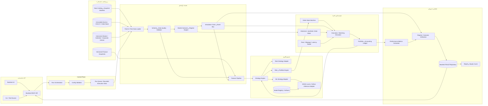
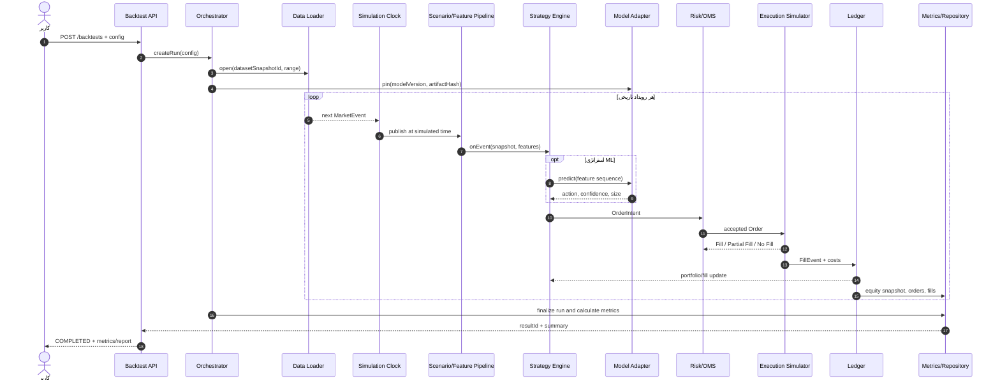

# سند معماری موتور Backtesting — فاز ۳

| مشخصه | مقدار |
|---|---|
| وضعیت | Implemented v1 / پیاده‌سازی و اعتبارسنجی‌شده |
| نسخه سند | 1.0 |
| تاریخ | 2026-08-08 |
| محدوده | تست استراتژی‌های Rule-based و ML روی داده تاریخی و سناریوهای بازار |
| سرویس میزبان پیشنهادی | Analysis API در `robot trader/server/` |

## ۱. هدف و محدوده

این سند معماری موتور Backtesting پروژه Intelligences-Trader را تعریف می‌کند. موتور باید:

- داده‌های تاریخی ذخیره‌شده در زیرساخت داده فاز ۱ را به‌عنوان **منبع اصلی و قابل ممیزی** مصرف کند؛
- استراتژی‌های قانون‌محور و مدل‌های آموزش‌دیده‌شده ML مانند PPO/TCN/ONNX را با یک قرارداد مشترک اجرا کند؛
- شرایط ثبت‌شده بازار و سناریوهای قطعی مانند افزایش نوسان، روند صعودی/نزولی، شکاف قیمت و کاهش نقدشوندگی را شبیه‌سازی کند؛
- سفارش، fill جزئی، کارمزد، slippage، محدودیت نقدشوندگی و وضعیت پرتفوی را به‌صورت event-driven بازپخش کند؛
- معیارهای Sharpe Ratio، Max Drawdown، Win Rate و Profit Factor را، خالص از هزینه‌ها، محاسبه کند؛
- هر اجرا را با نسخه داده، نسخه مدل، تنظیمات، seed و هش خروجی بازتولیدپذیر سازد.

### خارج از محدوده

- ارسال سفارش به کارگزار یا بازار زنده؛
- آموزش مجدد مدل در حین اجرای Backtest؛
- استفاده از داده شبکه‌ای جاری به‌جای snapshot تاریخی فاز ۱؛
- ادعای تطابق کامل با matching engine یک بورس خاص، مگر اینکه قوانین و داده عمق همان بورس به simulator افزوده شده باشد.

---

## ۲. اصول معماری

1. **Point-in-time correctness:** استراتژی در زمان `t` فقط داده‌ای با `availableAt <= t` می‌بیند؛ زمان وقوع رویداد (`eventTime`) به‌تنهایی به معنی قابل مشاهده بودن آن نیست.
2. **عدم نشت آینده:** scalerها، featureها، regimeها و corporate actionها باید با قواعد زمانی صریح تولید شوند. هیچ normalization روی کل بازه تست fit نمی‌شود.
3. **Deterministic replay:** ساعت شبیه‌سازی‌شده، PRNG دارای seed و شناسه‌های مبتنی بر sequence جایگزین `Date.now()` و تصادف بدون seed می‌شوند.
4. **Storage-first:** اجرای رسمی فقط از `datasetSnapshotId` تغییرناپذیر خوانده می‌شود. دریافت مستقیم از CCXT/TSETMC صرفاً مرحله ingest فاز ۱ است، نه بخشی از replay.
5. **Event-driven core:** candle، tick، snapshot دفتر سفارش، signal، order، fill، corporate action و session boundary همگی event هستند.
6. **Ports and adapters:** هسته Backtest از PostgreSQL، ONNX Runtime یا سرویس Python مستقل است و آن‌ها را از طریق interface مصرف می‌کند.
7. **Net performance:** PnL و معیارها پس از commission، fee، slippage، funding و tax تنظیم‌شده محاسبه می‌شوند.
8. **Auditability:** config، dataset/model hash، رخدادهای سفارش/fill، هش equity curve، warningها و خطاها برای هر run ذخیره می‌شوند.

---

## ۳. نمای معماری کلان



### مرزهای مهم

- **Control Plane** چرخه عمر run را مدیریت می‌کند، اما منطق مالی در هسته replay قرار دارد.
- **Replay Core** فقط رویدادهای مرتب و معتبر را منتشر می‌کند و زمان شبیه‌سازی را کنترل می‌کند.
- **Strategy Engine** intent تولید می‌کند؛ اجازه تغییر مستقیم balance یا position را ندارد.
- **Execution Simulator** تنها جزء مجاز برای ساخت fill است.
- **Ledger** منبع حقیقت cash، position، realized/unrealized PnL و equity در یک run است.
- **Metrics Calculator** خروجی خود را فقط از ledger و fillهای ثبت‌شده می‌سازد، نه از نتیجه ادعایی strategy یا مدل.

---

## ۴. اجزای اصلی

| جزء | مسئولیت | ورودی | خروجی |
|---|---|---|---|
| **Backtest API** | ایجاد، توقف و مشاهده run و دریافت گزارش | `BacktestRunConfig` | `runId`، status و result |
| **Run Orchestrator** | ساخت dependencyها، pin کردن snapshot/model، مدیریت lifecycle | config معتبر | job مستقل و قابل تکرار |
| **Run Queue / Execution Slots** | محدودسازی concurrency، اجرای موازی runها و yield دوره‌ای برای cancellation | job | progress، result یا failure |
| **Data Catalog** | resolve کردن snapshot تغییرناپذیر و manifest | `datasetSnapshotId` | URI/partitionها، schema version و hash |
| **Point-in-Time Data Loader** | خواندن chunk/stream مرتب بدون بارگذاری کل داده در RAM | snapshot، symbol، interval، range | جریان `MarketEvent` |
| **Data Quality Validator** | کنترل schema، timestamp، duplicate، gap و OHLC invariants | raw event stream | stream معتبر + quality report |
| **Simulation Clock / Event Bus** | ترتیب قطعی رویدادها و جلوگیری از دسترسی به آینده | رویدادهای مرتب | callbackهای `onEvent` و timer |
| **Scenario & Regime Engine** | انتخاب دوره‌های طبیعی یا تبدیل قطعی مسیر بازار | event، scenario config، seed | event تغییریافته + scenario labels |
| **Feature Pipeline** | ساخت feature فقط از گذشته یا خواندن feature snapshot سازگار | market events، feature schema | `FeatureVector` نسخه‌دار |
| **Strategy Engine** | lifecycle مشترک برای strategyهای Rule و ML | market snapshot، feature، portfolio | صفر یا چند `OrderIntent` |
| **ML Strategy Adapter** | تبدیل خروجی مدل به BUY/SELL/HOLD، confidence و size | feature sequence، artifact | signal استاندارد |
| **Model Registry / Inference** | pin و validate کردن artifact، scaler و schema و اجرای inference | `modelVersion`، tensor | prediction + provenance |
| **Risk & Portfolio Engine** | position sizing و حدود exposure/drawdown/leverage | intent + portfolio | order تأیید/ردشده |
| **Order State Machine** | مدیریت `NEW → OPEN → PARTIAL_FILLED → FILLED/CANCELLED/REJECTED` | order و fill event | وضعیت idempotent سفارش |
| **Execution Simulator** | matching، latency، partial fill و price impact | order، book/bar، cost config | `FillEvent` یا سفارش باز |
| **Accounting Ledger** | محاسبه cash، position، fee، PnL و mark-to-market | fill و market event | snapshot پرتفوی و equity curve |
| **Metrics Calculator** | محاسبه معیارهای عملکرد خالص از هزینه | equity returns، closed trades، fills | metrics کلی و دوره‌ای |
| **Attribution Engine** | شکستن نتیجه بر اساس regime، scenario، symbol و side | metrics + labels | breakdown و مقایسه سناریوها |
| **Result Repository** | ذخیره config، run، order/fill، metrics و artifactها | تمام خروجی‌های run | گزارش قابل بازیابی و ممیزی |
| **Observability** | log ساخت‌یافته، progress، runtime و هش‌ها | رخدادهای سیستمی | trace/log/metric عملیاتی |

---

## ۵. ارتباط و جریان اجرای اجزا

### ۵.۱ چرخه عمر یک Backtest

1. کاربر config را به API می‌فرستد.
2. `Config Validator` بازه، سرمایه، symbolها، strategy/model، هزینه‌ها و سناریو را validate می‌کند.
3. Orchestrator نسخه دقیق dataset و مدل را resolve و pin می‌کند؛ `datasetHash` و `modelHash` دیگر در طول run تغییر نمی‌کنند.
4. Data Loader رویدادها را به‌صورت chunked و با ترتیب `(availableAt, sequence)` می‌خواند.
5. Data Quality Validator بر اساس policy یکی از رفتارهای `FAIL`، `WARN_AND_SKIP` یا `WARN_AND_FILL` را اعمال می‌کند. forward-fill بین sessionها مجاز نیست.
6. Scenario Engine پیش از مشاهده strategy، تبدیل انتخاب‌شده را با seed ثابت اعمال می‌کند.
7. Simulation Clock زمان را جلو می‌برد و event قابل مشاهده را روی bus منتشر می‌کند.
8. Feature Pipeline با state فقط-گذشته feature می‌سازد. در ML، schema و scaler باید با artifact مدل هم‌هش باشند.
9. Strategy Engine یک `OrderIntent` می‌سازد. Risk Engine می‌تواند آن را resize یا reject کند.
10. OMS سفارش را ثبت می‌کند. Execution Simulator پس از latency تنظیم‌شده و با اطلاعات بازار قابل دسترس fill کامل/جزئی ایجاد می‌کند.
11. Ledger تنها بر مبنای fill، هزینه و mark price وضعیت پرتفوی را تغییر می‌دهد و feedback را به strategy می‌رساند.
12. در پایان هر دوره، equity snapshot ثبت می‌شود. پس از پایان، positionهای باز طبق policy بسته یا جداگانه mark می‌شوند.
13. Metrics و attribution محاسبه و همراه config، provenance، warningها و هش خروجی در Result Repository ذخیره می‌شوند.

### ۵.۲ دیاگرام توالی



---

## ۶. قراردادهای اصلی

نمونه‌ها برای روشن کردن boundary هستند؛ نام فیلد نهایی می‌تواند هنگام پیاده‌سازی version شود.

### ۶.۱ تنظیمات Run

```ts
interface BacktestRunConfig {
  schemaVersion: "1.0";
  datasetSnapshotId: string;
  instruments: string[];
  timeframe: "tick" | "1m" | "5m" | "15m" | "1h" | "1d";
  startAt: string;                 // ISO-8601 UTC
  endAt: string;                   // ISO-8601 UTC
  initialCash: number;
  baseCurrency: string;
  strategy: {
    type: "RULE" | "ML";
    name: string;
    version: string;
    parameters: Record<string, unknown>;
    modelVersion?: string;
  };
  execution: {
    fillModel: "ORDER_BOOK" | "BAR";
    latencyMs: number;
    commissionBps: number;
    slippageModel: "FIXED_BPS" | "VOLUME_IMPACT" | "BOOK_WALK";
    slippageBps?: number;
    participationRate?: number;
    intrabarPolicy: "WORST_CASE" | "LOWER_TIMEFRAME";
  };
  risk: {
    maxPositionNotional: number;
    maxLeverage: number;
    maxDrawdownPct: number;
    liquidateOnBreach: boolean;
  };
  scenario: {
    type: "HISTORICAL" | "VOLATILITY" | "TREND" | "GAP" | "LIQUIDITY_STRESS";
    parameters: Record<string, number>;
    seed: string;
  };
  endOfRunPositionPolicy: "LIQUIDATE" | "MARK_TO_MARKET";
}
```

### ۶.۲ رویداد بازار

```ts
interface MarketEvent {
  schemaVersion: string;
  eventId: string;
  datasetSnapshotId: string;
  instrumentId: string;
  type: "TICK" | "BAR" | "BOOK" | "CORPORATE_ACTION" | "SESSION";
  eventTime: number;               // زمان رخداد در منبع
  availableAt: number;             // اولین زمان مجاز برای مشاهده توسط strategy
  sequence: number;                // tie-break قطعی
  source: string;
  payload: unknown;
  qualityFlags: string[];
}
```

برای candle باید `open/high/low/close/volume` finite باشند، `low <= open, close <= high` برقرار باشد و timestampها برای هر instrument/timeframe یکتا باشند.

### ۶.۳ قرارداد Strategy

```ts
interface BacktestStrategy {
  initialize(context: StrategyContext): Promise<void> | void;
  onEvent(snapshot: MarketSnapshot): Promise<OrderIntent[]> | OrderIntent[];
  onFill(fill: FillEvent, portfolio: PortfolioSnapshot): Promise<void> | void;
  finalize(): Promise<Record<string, unknown>> | Record<string, unknown>;
}
```

Rule-based و ML هر دو این interface را پیاده می‌کنند. `OrderIntent` هنوز معامله نیست؛ فقط Execution Simulator می‌تواند `FillEvent` صادر کند.

### ۶.۴ قرارداد مدل ML

هر artifact قابل استفاده باید این metadata را داشته باشد:

- `modelVersion` و `artifactSha256`؛
- نوع runtime مانند `onnx` یا `python`؛
- `featureSchemaVersion` و `featureSchemaHash`؛
- ترتیب featureها، `sequenceLength` و dtype/shape ورودی؛
- scaler/normalizer fit‌شده در train و هش آن؛
- mapping خروجی، برای مثال `0=SELL, 1=HOLD, 2=BUY`؛
- training dataset hash، training cutoff و code commit؛
- deterministic inference settings و calibration metadata.

اگر hash یا shape با Feature Pipeline یکسان نباشد، run باید قبل از شروع با وضعیت `REJECTED` پایان یابد.

### ۶.۵ خروجی Run

حداقل خروجی شامل موارد زیر است:

- config canonical و `configHash`؛
- `datasetSnapshotId/datasetHash` و `modelVersion/modelHash`؛
- status، زمان واقعی اجرا، seed، warning و quality report؛
- لیست orderها، fillها، هزینه‌ها و transitionهای OMS؛
- equity/returns/drawdown curve؛
- metrics کلی و breakdown بر اساس regime/scenario/symbol؛
- `resultHash` برای بررسی بازتولیدپذیری.

---

## ۷. پشتیبانی از شرایط مختلف بازار

دو روش مکمل استفاده می‌شود:

### ۷.۱ سناریوهای طبیعی (Historical Regimes)

- بازپخش بازه‌های واقعی برچسب‌خورده به low/medium/high volatility، trending up/down و ranging؛
- برچسب regime برای attribution از HMM فعلی `ml_service/regime_detector.py` یا snapshot ذخیره‌شده خوانده می‌شود؛
- اگر regime feature ورودی strategy باشد، فقط برچسبی که در همان زمان و با داده گذشته تولید شده قابل استفاده است. برچسب hindsight فقط برای گزارش پس از اجرا مجاز است.

### ۷.۲ سناریوهای مصنوعی قطعی

| سناریو | تبدیل پیشنهادی | کنترل‌ها |
|---|---|---|
| `VOLATILITY` | scale کردن log-return حول drift محلی | ضریب نوسان، seed |
| `TREND` | افزودن drift به log-price path | جهت و bps در هر دوره |
| `GAP` | اعمال jump در event مشخص | اندازه، جهت و timestamp |
| `LIQUIDITY_STRESS` | کاهش depth/volume، افزایش spread و impact | depth multiplier، spread multiplier |
| Cost sensitivity | تغییر fee، latency و slippage | matrix پارامترها در Execution Config |

Scenario Engine پس از تبدیل close، مقادیر OHLC را با حفظ invariantها بازسازی می‌کند. داده تغییریافته همیشه با `synthetic=true`، پارامترها و `scenarioHash` علامت‌گذاری می‌شود و هرگز به‌عنوان داده واقعی فاز ۱ بازنویسی نمی‌گردد.

برای مقایسه robust، یک run والد می‌تواند matrix سناریو را به چند child run با dataset/model یکسان و scenario متفاوت گسترش دهد.

---

## ۸. مدل زمان و شبیه‌سازی اجرا

### قواعد پیش‌فرض

- سیگنال ساخته‌شده با candle بسته‌شده در `t` زودتر از اولین رویداد قابل معامله بعد از `t + latency` اجرا نمی‌شود.
- در داده bar، پیش‌فرض اجرای market order روی **open کندل بعدی** است. حالت `next-bar-close` موجود فقط به‌عنوان compatibility mode و با برچسب صریح نگه داشته می‌شود.
- اگر در یک bar هم stop-loss و هم take-profit لمس شوند و داده ریزتر موجود نباشد، `WORST_CASE` استفاده می‌شود؛ ترتیب مطلوب برای strategy فرض نمی‌شود.
- در مدل order book، market order سطح‌ها را walk می‌کند و در نبود عمق کافی partial fill می‌گیرد.
- limit order برای صرفاً لمس‌شدن قیمت fill تضمینی ندارد؛ queue/participation policy باید لحاظ شود.
- هزینه‌ها در هر fill ثبت می‌شوند و سپس ledger به‌روزرسانی می‌شود.
- mark-to-market با قیمت معتبر و قابل مشاهده همان زمان انجام می‌شود.

### مدل‌های قابل تعویض Execution

1. **BarFillModel:** سریع برای پژوهش اولیه؛ پشتیبانی از next-open، OHLC trigger و participation cap.
2. **OrderBookFillModel:** دقیق‌تر برای snapshot/tick؛ book walking، partial fill و spread واقعی.
3. **CostModel:** fee/maker-taker، مالیات، funding، fixed/volume impact slippage.
4. **LatencyModel:** ثابت یا توزیع تجربی version‌شده و دارای seed.

---

## ۹. معیارهای عملکرد

معیارها از **equity returnهای هم‌فاصله** و closed tradeهای خالص از هزینه محاسبه می‌شوند، نه از مقدار confidence مدل.

| معیار | تعریف |
|---|---|
| **Sharpe Ratio** | `sqrt(P) × mean(r_t - rf_t) / std(r_t - rf_t)`؛ `P` تعداد دوره سالانه بر اساس calendar/timeframe است. اگر انحراف معیار صفر باشد مقدار `null` همراه reason گزارش می‌شود. |
| **Max Drawdown** | `max_t((peak_t - equity_t) / peak_t)`؛ به‌صورت عدد مثبت بین ۰ و ۱، همراه peak time، trough time و recovery time. |
| **Win Rate** | `winning closed trades / all closed trades`؛ break-even جداگانه گزارش می‌شود. |
| **Profit Factor** | `gross profit / abs(gross loss)` پس از هزینه‌ها؛ اگر زیان وجود نداشته باشد `null` همراه reason، نه عدد JSON نامعتبر `Infinity`. |

خروجی پیشنهادی تکمیلی: total return، CAGR، volatility، Sortino، Calmar، average win/loss، expectancy، turnover، exposure، fee/slippage totals، trade count، holding period و signal accuracy. همه معیارها باید هم به‌صورت کلی و هم به تفکیک scenario/regime قابل محاسبه باشند.

پارامترهای annualization و risk-free rate در config/result ذخیره می‌شوند؛ برای تقویم معاملاتی ایران نباید `252` بدون استفاده از Trading Calendar به‌صورت ثابت فرض شود.

---

## ۱۰. ذخیره‌سازی و API پیشنهادی

### موجودیت‌های منطقی

- `backtest_runs`: config، provenance، status، progress، hashes و error؛
- `backtest_orders` و `backtest_order_events`: intent و transitionهای OMS؛
- `backtest_fills`: quantity، price، fee، slippage و liquidity source؛
- `backtest_equity_points`: cash، positions value، equity و drawdown؛
- `backtest_metrics`: نام معیار، مقدار، unit و dimensionهای attribution؛
- `backtest_artifacts`: report، curveهای فشرده و quality log.

برای runهای بزرگ، event/equity artifactها می‌توانند در object storage فاز ۱ باشند و PostgreSQL فقط URI و hash را نگه دارد. Redis فقط cache/progress است و منبع حقیقت run نیست.

### API

```text
GET    /api/backtests/health          وضعیت queue، persistence و ظرفیت اجرا
POST   /api/backtests                 ایجاد run
GET    /api/backtests/:runId          status، progress و provenance
POST   /api/backtests/:runId/cancel   درخواست لغو idempotent
GET    /api/backtests/:runId/results  summary، metrics و attribution
GET    /api/backtests/:runId/artifacts/:name
POST   /api/backtests/compare         مقایسه چند run سازگار
```

وضعیت‌ها: `QUEUED → VALIDATING → RUNNING → FINALIZING → COMPLETED` و مسیرهای نهایی `REJECTED | FAILED | CANCELLED`.

---

## ۱۱. نگاشت به کد موجود و شکاف‌های برطرف‌شده

هسته معماری این سند اکنون به‌صورت مستقل در `robot trader/server/modules/backtesting/` پیاده‌سازی شده است. کد P2 فقط سطح سازگاری قدیمی است و محدودیت‌های prototype آن وارد موتور فاز ۳ نشده‌اند. جدول زیر علت جداسازی و اصلاح انجام‌شده را نشان می‌دهد.

| کد موجود | نقش در معماری هدف | راهکار پیاده‌سازی‌شده |
|---|---|---|
| `p2/backtest/BacktestHarness.js` | سطح compatibility | موتور مستقل event-driven با clock، multi-symbol و lifecycle strategy؛ harness قدیمی نیز به PnL مبتنی بر مسیر قیمت اصلاح شد |
| `p2/data/HistoricalDataProvider.js` | فقط ingest/dev adapter | اجرای رسمی فقط از snapshot ذخیره‌شده در `DataCatalog` و بدون fetch شبکه انجام می‌شود |
| `p2/data/DataNormalizer.js` | compatibility feature transform | min/max کل بازه حذف و normalization قدیمی causal شد؛ ML فاز ۳ از `CausalFeaturePipeline` و normalizer hash استفاده می‌کند |
| `modelManager.js` | runtime موجود ONNX | `OnnxModelAdapter` نسخه، session، artifact مرکب ONNX، feature schema و normalizer را pin و validate می‌کند |
| `p2/ml/MLSignalBridge.js` | سطح paper-trading قدیمی | `StrategyEngine` جدید inference را از execution جدا و فقط `OrderIntent` تولید می‌کند |
| `P2ExecutionEngine.js` | سطح paper-trading قدیمی | `ExecutionSimulator` جدید از sequence/time شبیه‌سازی‌شده استفاده می‌کند و PnL فقط در ledger از fill واقعی ساخته می‌شود |
| `OrderBookSimulator.js` | prototype دفتر سفارش | fill model جدید book walking، partial fill، limit/stop و audit transitionها را پیاده‌سازی می‌کند |
| `OrderStateMachine.js` | OMS قدیمی | هر run دارای order sequence، event log و state مستقل است |
| `PerformanceAnalytics.js` | compatibility analytics | `PerformanceMetrics` جدید از equity return واقعی، سرمایه قابل تنظیم و annualization صریح استفاده می‌کند |
| `TradeRepository.js` | persistence قدیمی paper trade | `BacktestRepository` snapshot و run/result را در PostgreSQL با fallback حافظه ذخیره می‌کند |
| `ml_service/regime_detector.py` | regime provider پژوهشی | موتور فاز ۳ برچسب causal داخلی تولید و attribution را از تصمیم strategy جدا می‌کند؛ snapshot regime نیز قابل version شدن است |

> نکته حیاتی: `PaperTradingEngine.executeTrade()` فعلی PnL را بر اساس هم‌راستایی forecast و یک profit factor ثابت می‌سازد. در موتور Backtesting هدف، PnL فقط باید از entry/exit fillها و تغییر واقعی/سناریویی قیمت محاسبه شود.

### ساختار پوشه پیاده‌سازی‌شده

```text
robot trader/server/modules/backtesting/
├── api/                  # Express router
├── application/          # BacktestService, queue و BacktestEngine
├── domain/               # clock, strategy, features, risk, execution, ledger و metrics
├── infrastructure/       # DataCatalog، PostgreSQL repository و ONNX adapter
├── scenarios/            # deterministic scenario/regime transforms
└── index.js              # public module surface
```

وابستگی‌ها باید به سمت domain باشند: infrastructure interfaceهای domain/application را پیاده می‌کند، نه برعکس.

---

## ۱۲. امنیت، قابلیت اطمینان و کارایی

- endpointهای ایجاد/لغو run مانند سایر routeهای پرهزینه تحت authentication، authorization و rate limit قرار گیرند.
- strategy plugin نباید دسترسی مستقیم filesystem/network یا mutable global state داشته باشد؛ برای plugin خارجی worker/process sandbox لازم است.
- محدودیت `maxEvents`، `maxRuntime`، memory و concurrency برای هر run اعمال شود.
- worker crash نباید run ناقص را `COMPLETED` کند؛ checkpoint فقط در مرز event قطعی ذخیره شود.
- eventها chunked/streaming خوانده شوند؛ partitioning اولیه بر اساس snapshot/date/instrument انجام شود.
- اجرای یک strategy به‌صورت ترتیبی است؛ parallelism بین runها/سناریوها اعمال می‌شود تا ترتیب eventها تغییر نکند.
- logها شامل `runId` و correlation id هستند و secret یا payload حساس در آن‌ها ثبت نمی‌شود.

---

## ۱۳. راهبرد تست و معیار پذیرش

### تست‌ها

1. **Unit:** فرمول metricها، cost/slippage، transitionهای OMS، portfolio accounting و scenario transforms.
2. **Contract:** سازگاری schema داده فاز ۱ و metadata مدل با loader/feature pipeline.
3. **Golden replay:** config + snapshot + model + seed ثابت باید `resultHash` یکسان ایجاد کند.
4. **No-look-ahead:** افزودن/تغییر داده بعد از `t` نباید signal یا feature قبل از `t` را تغییر دهد.
5. **Accounting invariants:** `equity = cash + marked positions` و جمع fill/feeها با ledger برابر باشد.
6. **Execution edge cases:** gap، حجم صفر، partial fill، simultaneous stop/target، session close و corporate action.
7. **Scenario properties:** OHLC invariantها، قیمت مثبت، seed تکرارپذیر و عدم تغییر snapshot اصلی.
8. **Integration:** از API تا PostgreSQL با ONNX pinned و dataset fixture کوچک.
9. **Performance:** replay حداقل حجم هدف با سقف memory و زمان از پیش تعیین‌شده.

### معیار پذیرش معماری

- یک strategy قانون‌محور و یک مدل ONNX از همان Strategy Contract اجرا شوند.
- run رسمی بدون `datasetSnapshotId` یا با artifact/schema ناسازگار رد شود.
- دو اجرای یکسان، order/fill/equity/metrics و `resultHash` یکسان تولید کنند.
- Sharpe، Max Drawdown، Win Rate و Profit Factor با fixture دستی و نتیجه شناخته‌شده تطبیق داشته باشند.
- سناریوهای historical، volatility، trend و liquidity stress حداقل پشتیبانی شوند.
- هیچ signal در candle `t` در همان close با قیمت از پیش دیده‌شده fill نشود.
- تمام PnLها از fill و price path تولید شوند و هزینه‌ها در equity نهایی منظور شوند.

---

## ۱۴. ترتیب پیاده‌سازی انجام‌شده

1. **هسته قطعی:** قراردادها، SimulationClock، EventBus، Portfolio Ledger و refactor مدل زمان در execution.
2. **اتصال داده فاز ۱:** Data Catalog/Loader، snapshot manifest، validation و dataset hashing.
3. **Strategyها و ML:** Rule adapter، ONNX adapter، feature schema/scaler validation و signal mapping.
4. **Execution:** BarFillModel، OMS، fee/slippage؛ سپس OrderBookFillModel و partial fills.
5. **سناریوها:** historical attribution، volatility/trend و liquidity stress با seed/hash.
6. **Metrics و persistence:** معیارهای اصلی، repository، API و report artifacts.
7. **سخت‌سازی:** no-look-ahead/golden tests، worker isolation، resource limits و observability.

این ترتیب ابتدا صحت زمانی و حسابداری را تثبیت می‌کند؛ افزودن UI یا سناریوهای پیچیده پیش از این دو مورد، خطر تولید نتایج ظاهراً دقیق اما غیرقابل اعتماد را دارد.
