# گزارش یکپارچه‌ی موتور Backtesting

> **وضعیت:** آزمایش پژوهشی و شبیه‌سازی؛ این نتایج توصیه‌ی سرمایه‌گذاری یا ادعای عملکرد زنده نیستند.

## تنظیمات آزمایش

- بازه: `2023-10-27` تا `2024-11-29`، تایم‌فریم `1d`
- سرمایه‌ی اولیه‌ی هر اجرا: `10,000`؛ Slippage: `0.1%`؛ Commission: `0.1%` در هر سمت
- اجرا: سیگنال در پایان کندل و معامله در Open کندل بعدی (Next-Bar-Open)
- تسویه: هر موقعیت باز در آخرین Close بسته شده و هزینه‌ی خروج در P/L منظور شده است.
- معیارها از دفتر معاملات بسته‌شده‌ی `PerformanceMetrics` محاسبه شده‌اند؛ Drawdown به‌صورت signed گزارش می‌شود.
- CSV کامل: [`backtest_results.csv`](backtest_results.csv)

## جدول مقایسه‌ای

| نماد | استراتژی | کندل | معامله | سرمایه نهایی | بازده کل | بازده سالانه | Sharpe | Max DD | Win Rate | Profit Factor | کارمزد | لغزش |
|---|---|---:|---:|---:|---:|---:|---:|---:|---:|---:|---:|---:|
| BTC/USDT | Moving Average Crossover | 400 | 3 | 11,334.56 | 13.35% | 25.69% | 0.124 | -18.31% | 33.33% | 1.729 | 59.86 | 59.86 |
| BTC/USDT | Mean Reversion | 400 | 9 | 2,379.87 | -76.20% | -74.81% | -0.438 | -76.20% | 77.78% | 0.229 | 92.01 | 92.01 |
| BTC/USDT | ML-Based PPO/TCN | 400 | 0 | 10,000.00 | 0.00% | 0.00% | 0.000 | 0.00% | 0.00% | 0.000 | 0.00 | 0.00 |
| ETH/USDT | Moving Average Crossover | 400 | 2 | 5,941.10 | -40.59% | -61.34% | -2.058 | -40.59% | 0.00% | 0.000 | 40.23 | 40.23 |
| ETH/USDT | Mean Reversion | 400 | 5 | 2,785.55 | -72.14% | -72.34% | -0.852 | -72.14% | 40.00% | 0.130 | 70.67 | 70.67 |
| ETH/USDT | ML-Based PPO/TCN | 400 | 0 | 10,000.00 | 0.00% | 0.00% | 0.000 | 0.00% | 0.00% | 0.000 | 0.00 | 0.00 |
| AAPL | Moving Average Crossover | 275 | 1 | 10,536.18 | 5.36% | 19.50% | 0.000 | 0.00% | 100.00% | — | 20.54 | 20.54 |
| AAPL | Mean Reversion | 275 | 7 | 10,633.57 | 6.34% | 6.48% | -0.156 | -14.28% | 57.14% | 1.381 | 143.42 | 143.42 |
| AAPL | ML-Based PPO/TCN | 275 | 0 | 10,000.00 | 0.00% | 0.00% | 0.000 | 0.00% | 0.00% | 0.000 | 0.00 | 0.00 |

## تحلیل نتایج

- بهترین اجرای این نمونه **Moving Average Crossover روی BTC/USDT** با بازده 13.35% بود.
- ضعیف‌ترین اجرا **Mean Reversion روی BTC/USDT** با بازده -76.20% بود.
- از ۹ اجرا، 3 اجرا بازده مثبت داشتند.
- میانگین بازده استراتژی‌ها روی سه نماد: **ML-Based PPO/TCN** = 0.00%، **Moving Average Crossover** = -7.29%، **Mean Reversion** = -47.34%.
- مقایسه‌ی مستقیم Sharpe باید با احتیاط انجام شود: قرارداد فعلی `PerformanceMetrics` بازده هر معامله را نسبت به سرمایه‌ی اولیه و نرخ بدون ریسک را به‌ازای هر مشاهده اعمال می‌کند.
- مدل PPO/TCN واقعاً از artifact موجود ONNX اجرا شده است؛ خروجی اندازه‌ی مدل برای اندازه‌ی موقعیت استفاده می‌شود. چون OHLCV داده‌ی L2 ندارد، ویژگی OBI با مقدار خنثی صفر پر شده است.
- مدل پس از warm-up در مجموع 988 تصمیم Hold و 0 تصمیم جهت‌دار صادر کرد؛ صفر بودن معامله/بازده ML نتیجه‌ی مستقیم خروجی مدل است، نه جایگزینی نتیجه‌ی ساختگی.
- مدل فعلی در `train.py` روی داده‌ی مصنوعی آموزش دیده و model card تأییدشده ندارد؛ بنابراین نتیجه‌ی ML صرفاً sanity check یکپارچه‌سازی است و اعتبار out-of-sample تجاری محسوب نمی‌شود.

## پیشنهادهای بهبود

1. Walk-forward validation و تقسیم زمانی train/validation/test با دوره‌های بازار متفاوت اضافه شود.
2. مدل PPO/TCN روی snapshot واقعیِ نسخه‌بندی‌شده بازآموزی و همراه با scaler، feature schema، seed و model card منتشر شود.
3. برای ML داده‌ی واقعی L2/OBI تهیه شود؛ جای‌گذاری صفر تنها یک fallback شفاف است.
4. اندازه‌ی موقعیت، حدود exposure، stop-loss و circuit breaker در سناریوهای stress و هزینه‌های متفاوت بررسی شوند.
5. برای سهام، تقویم ۲۵۲روزه و برای کریپتو تقویم ۳۶۵روزه به‌صورت جداگانه در annualization/Sharpe پشتیبانی شود.
6. Bootstrap confidence interval، معیار Buy-and-Hold و آزمون حساسیت Slippage/Commission به گزارش افزوده شود.

## نمودارهای Equity Curve و Drawdown

### BTC/USDT — Moving Average Crossover

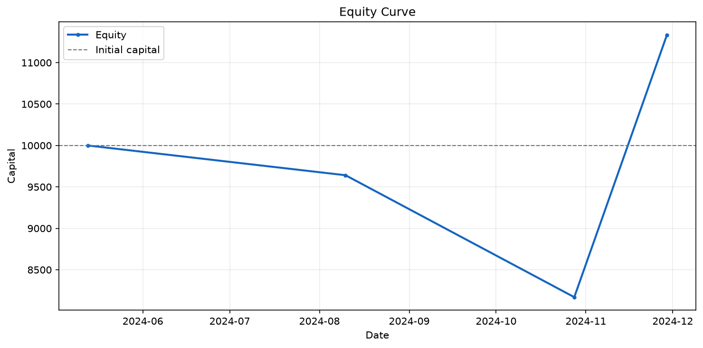

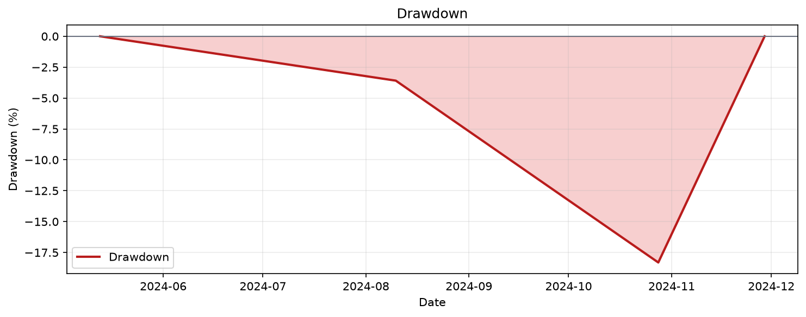

### BTC/USDT — Mean Reversion

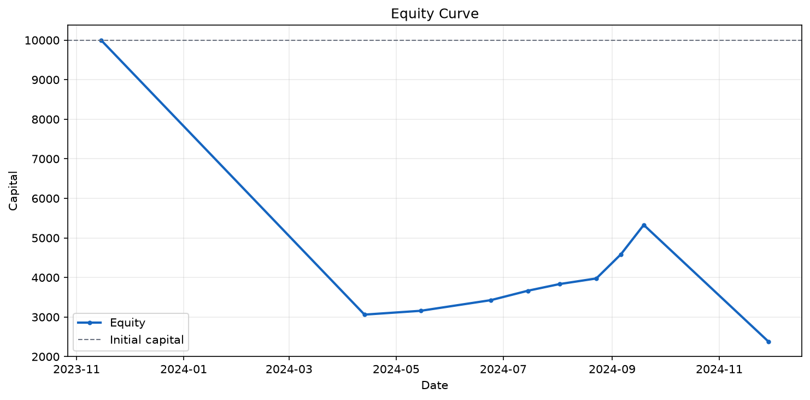

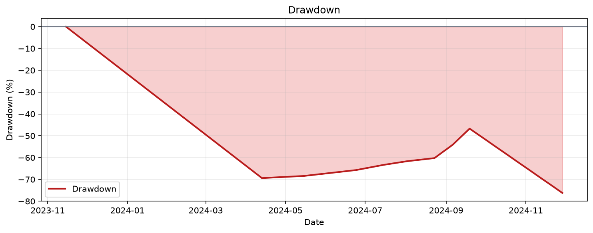

### BTC/USDT — ML-Based PPO/TCN

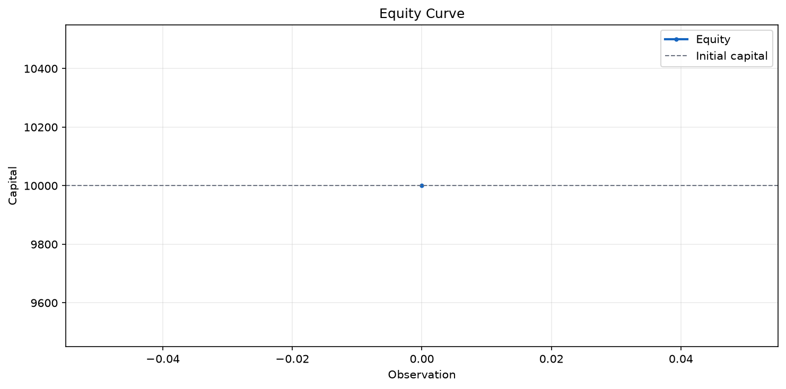


### ETH/USDT — Moving Average Crossover

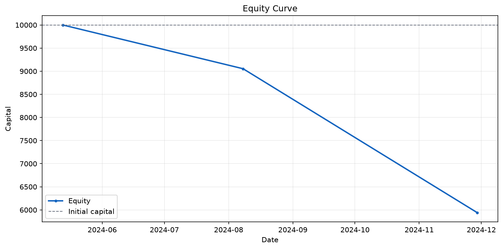

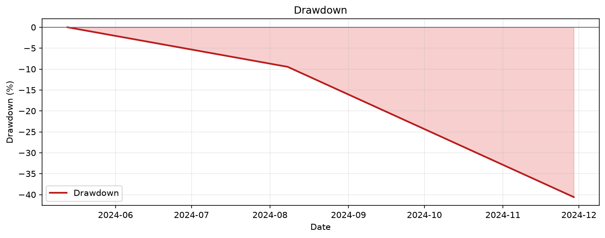

### ETH/USDT — Mean Reversion

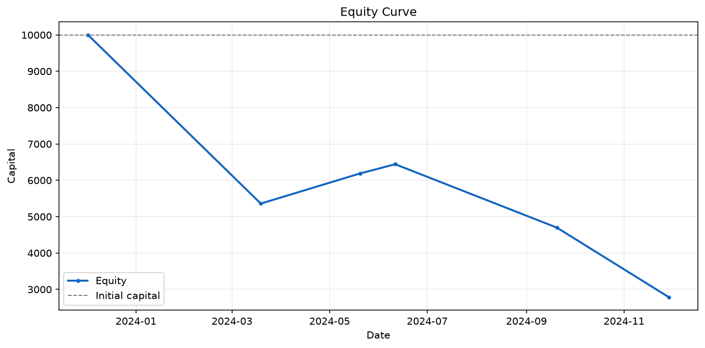

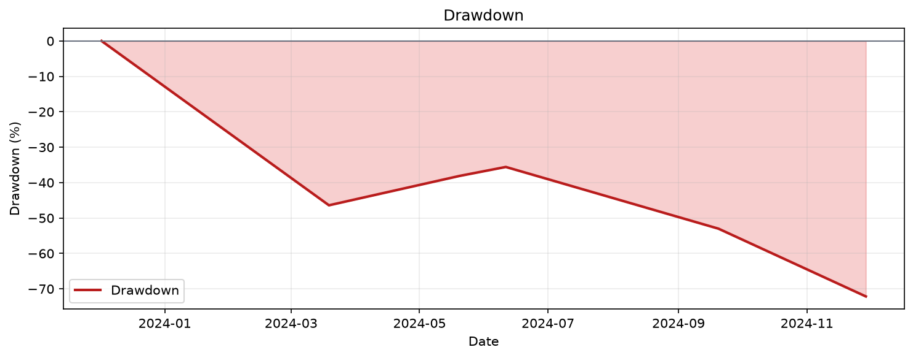

### ETH/USDT — ML-Based PPO/TCN


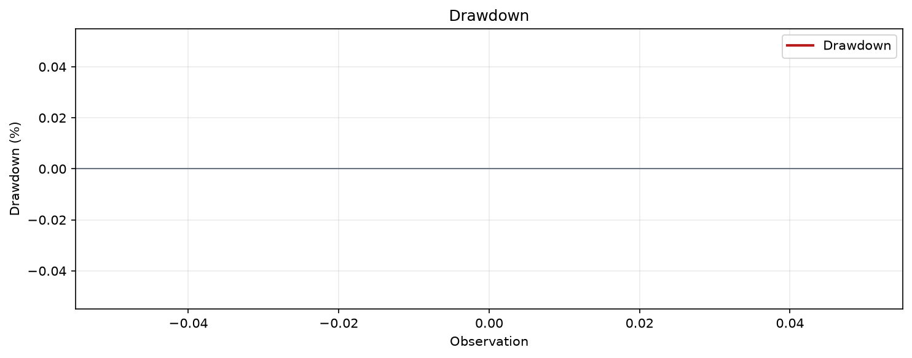

### AAPL — Moving Average Crossover

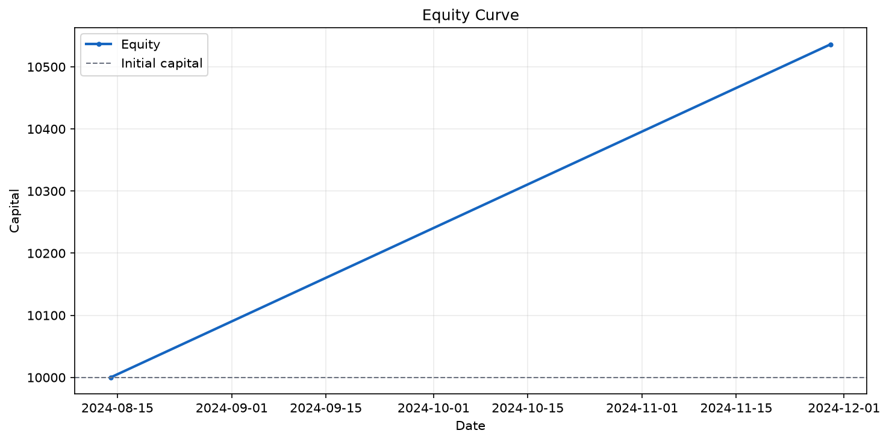

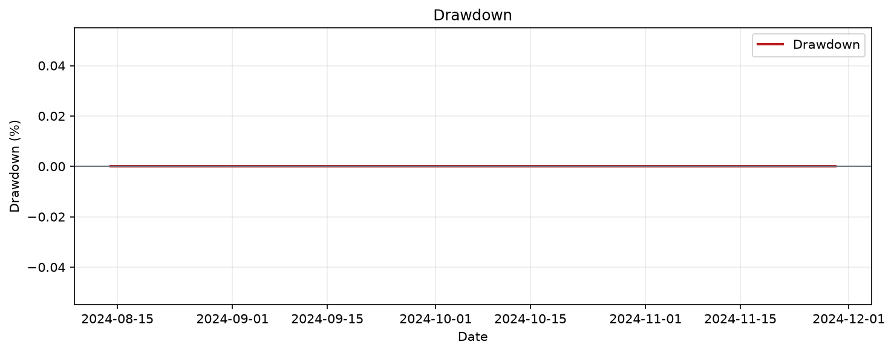

### AAPL — Mean Reversion

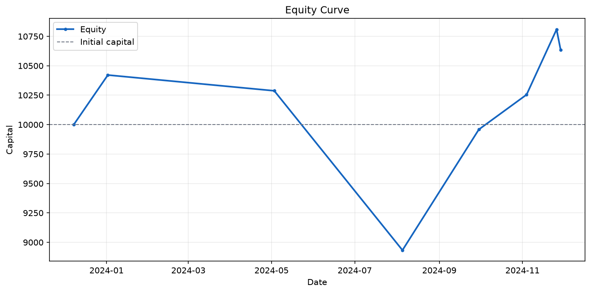

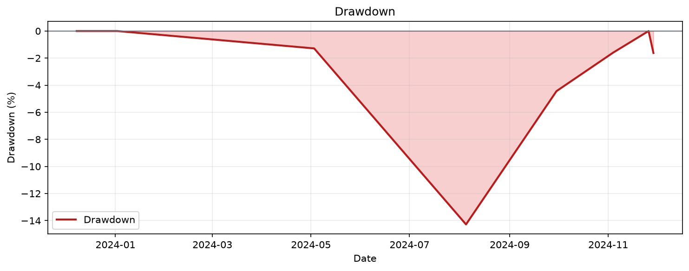

### AAPL — ML-Based PPO/TCN


## منشأ و قابلیت بازتولید داده

| نماد | منبع | تعداد | اولین/آخرین روز | SHA-256 |
|---|---|---:|---|---|
| BTC/USDT | [Binance spot klines](https://github.com/congde/web3-quant-sandbox/blob/e6731d872ff0c807559d2741249248b9ff9dd6a6/data/investment_gate/BTCUSDT.csv) | 400 | 2023-10-27 / 2024-11-29 | `473613646d70a2a767b1f9bc1a3fa681fe19f6239c0e61603d29f8d0196d9222` |
| ETH/USDT | [Binance spot klines](https://github.com/congde/web3-quant-sandbox/blob/e6731d872ff0c807559d2741249248b9ff9dd6a6/data/investment_gate/ETHUSDT.csv) | 400 | 2023-10-27 / 2024-11-29 | `222e233cb1d5e2ec4e5d6b6897fe2af56f28ea6299477b64287bea674c34c830` |
| AAPL | [Yahoo Finance snapshot](https://github.com/FarhanAli97/Apple-AAPL-Stock-Data-1980-to-December-2024/blob/35431ef9c6a0f1408d3a9218ef4c47034704c126/Apple%20(AAPL)%20From%201980%20To%20Dec-2024.csv) | 275 | 2023-10-27 / 2024-11-29 | `3e28f885ca1dee0a3951bf684159538e48d888dffbff27eee3f3956b75c9550d` |

- مدل ONNX: `market_model.onnx` — SHA-256: `9ec9c786a5441663c9c6aeaaebbddd833211bf44ad9d46e8c194ce3ebfac6c91`
- tensor data: `market_model.onnx.data` — SHA-256: `07e9dc2c913ec1eba1b6262f7069a02cba7b8218ed37ff1c9923aa5102a61508`

## اجرای مجدد

```bash
cd ml_service
uv sync --locked
uv run python run_backtests.py
uv run pytest -q
```
