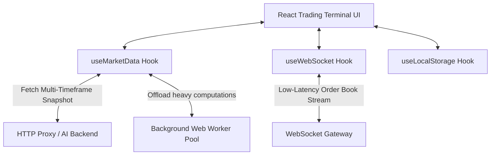

# KalayBot Trading Terminal

The high-performance client dashboard for the Intelligences-Trader ecosystem, built with **React**, **TypeScript**, **Vite v7**, and **TailwindCSS v4**.

---

## 📂 Directory Layout

```
robot trader/
├── dist/                  # Built static production distribution assets
├── server/                # AI and Quant Analysis Backend (TensorFlow.js / ONNX)
├── src/
│   ├── components/
│   │   ├── analytics/     # Panels: OrderBook, Sentiment, Arbitrage, Correlation
│   │   ├── common/        # Shared primitives: MetricCard
│   │   └── dashboard/     # Layout shells: DashboardHeader, TradePanel
│   ├── hooks/             # React hooks: useMarketData, useWebSocket, useLocalStorage
│   ├── App.tsx            # Application container and routing shell
│   ├── index.css          # Core styles & Tailwind CSS v4 design system tokens
│   └── main.tsx           # React virtual DOM entry point
├── tests/                 # Integration and behavioral frontend tests
├── tsconfig.json          # TypeScript workspace compiler settings
└── vite.config.ts         # Vite build configuration with Tailwind CSS v4 plugin
```

---

## 🏗 Component & Hook Architecture

The client application separates business logic from presentational elements using a modular custom hook architecture:



### 1. **Core Custom Hooks (`/src/hooks`)**
- `useMarketData`: Orchestrates batch data fetching across multiple timeframes, manages analysis dispatching to workers/backend, and tracks model training states.
- `useWebSocket`: Manages low-latency real-time streams for Level 2 Order Books and price action ticks, featuring exponential backoff reconnection logic.
- `useLocalStorage`: Handles state persistence for user balances, open trades, and custom risk parameters.

### 2. **Component Structure**
- **Dashboard Modules (`/components/dashboard`)**: Structures main views, charts, and execution panels (such as `TradePanel`).
- **Analytics Panels (`/components/analytics`)**: Renders real-time financial tools (e.g. market correlation maps, L2 depth charts, NLP sentiment logs).
- **Common Primitives (`/components/common`)**: Styled re-usable widgets (e.g., metric cards with delta displays).

---

## 🎨 Design System: "Institutional Glassmorphism"

The visual language is optimized for financial terminals operating in dark-room configurations:
- **Depth & Transparency:** Employs CSS backdrop blurs and subtle drop shadows to create layout layers.
- **Micro-Animations:** Interactive elements feature transitions for hover and active states.
- **State-aware Highlights:** Color channels correspond to system states:
  - <span style="color:#10b981">**Emerald (Growth/Buy):**</span> Upward momentum, active profit, and positive sentiment.
  - <span style="color:#f43f5e">**Rose (Risk/Sell):**</span> Downward pressure, stop-loss warnings, and sell signals.
  - <span style="color:#f59e0b">**Amber (Caution):**</span> Connectivity alerts, extreme volatility warnings, or shadow-mode deviation anomalies.

---

## 🔬 Performance & Memory Optimizations

To handle high-frequency tick updates without stuttering the user interface, we implement three critical optimization layers:

- **Web Worker Pool:** Heavy computation tasks (e.g. calculating complex indicators like Ichimoku or ATR, or analyzing historical pricing models) are offloaded to background threads. This keeps the browser's main thread free to handle 60 FPS UI rendering.
- **SharedArrayBuffer:** Background threads and the main thread communicate updates efficiently, utilizing `SharedArrayBuffer` to avoid data serialization overhead.
- **TypedArrays:** All historical price series and tick lists are represented as fixed-length typed float arrays (`Float64Array`) to minimize garbage collection cycles.
