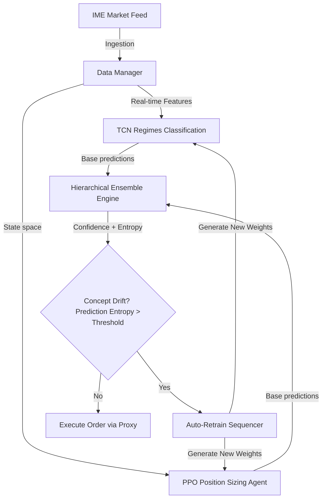

# AI & Quant Analysis Backend

The core intelligence layer of the Intelligences-Trader ecosystem, powered by **TensorFlow.js**, **ONNX Runtime**, and **Node.js**.

---

## 🧠 Model Architectures & Mathematical Frameworks

### 1. Temporal Convolutional Network (TCN)
Used for time-series sequence classification to identify trend direction and market regimes across multiple timeframes.
- **Dilated Causal Convolutions:** Ensures predictions at time step \(t\) only depend on past states. The dilated causal convolution operator is defined as:
  \[y(t) = (x * _d f)(t) = \sum_{i=0}^{k-1} f(i) \cdot x(t - d \cdot i)\]
  where \(f\) is the filter of size \(k\), \(d\) is the dilation factor, and \(x(t - d \cdot i)\) enforces temporal causality.
- **Focal Loss Function:** Addresses extreme class imbalance (rare profit opportunities vs. noise) by down-weighting easy-to-classify samples:
  \[FL(p_t) = -\alpha_t (1 - p_t)^\gamma \log(p_t)\]
  where \(\gamma \ge 0\) is the focusing parameter and \(\alpha_t\) is the class-balancing factor.
- **Expected Calibration Error (ECE):** Monitors confidence alignment to verify if the output probabilities reflect true market execution success rates:
  \[ECE = \sum_{m=1}^{M} \frac{|B_m|}{N} \left| acc(B_m) - conf(B_m) \right|\]
  where \(B_m\) represents the samples in the \(m\)-th confidence bin, and \(N\) is the total sample count.

---

### 2. PPO Reinforcement Learning Agent
Controls continuous position sizing based on real-time portfolio metrics, simulating Kelly Criterion mechanics.
- **Clipped Surrogate Objective:** Prevents destabilizing policy updates in volatile regimes:
  \[L^{CLIP}(\theta) = \hat{\mathbb{E}}_t \left[ \min\left(r_t(\theta)\hat{A}_t, \, \text{clip}(r_t(\theta), 1-\epsilon, 1+\epsilon)\hat{A}_t\right) \right]\]
  where \(r_t(\theta) = \frac{\pi_\theta(a_t|s_t)}{\pi_{\theta_{old}}(a_t|s_t)}\) is the probability ratio, \(\hat{A}_t\) is the advantage estimate, and \(\epsilon\) is the clipping parameter.
- **Entropy Bonus Adjustment:** Integrates policy entropy \(\mathcal{H}\) into the loss function to encourage continuous exploration of continuous action spaces and avoid local minima convergence:
  \[L^{PPO}(\theta) = L^{CLIP}(\theta) - c_1 L^{VF}(\theta) + c_2 \mathcal{H}(\pi_\theta(\cdot|s_t))\]

---

### 3. Hierarchical Ensemble Engine
A meta-learner model fuses predictions from the TCN, an LSTM, and rule-based trading heuristics.
- **Softmax Attention Fusing:** Dynamically weights base model predictions:
  \[w_j = \frac{e^{score_j / \tau}}{\sum_{k} e^{score_k / \tau}}\]
- **Adaptive Temperature Scaling:** The temperature parameter \(\tau\) is adjusted in real-time based on the rolling variance of base-model classification errors.

---

## 📡 Advanced Frameworks

### Federated Learning (FedAvg)
Aggregates models trained locally across decentralized trading instances without centralizing raw market data.
- **Aggregation Formula with Differential Privacy:**
  \[w_{t+1} = \sum_{k=1}^{K} \frac{n_k}{n} (w_t^k + \eta \Delta w_t^k + \mathcal{N}(0, \sigma^2 I))\]
  where \(\mathcal{N}(0, \sigma^2 I)\) is the Gaussian noise vector injected to guarantee privacy boundaries.

### Explainable AI (XAI)
Guarantees transparency for institutional trading strategies.
- **SHAP (Shapley Additive Explanations):** Explains model prediction deltas using Shapley values:
  \[\phi_i(v) = \sum_{S \subseteq F \setminus \{i\}} \frac{|S|!(|F| - |S| - 1)!}{|F|!} \left( v(S \cup \{i\}) - v(S) \right)\]
  where \(F\) is the complete set of features, \(S\) is the subset of features excluding index \(i\), and \(v(S)\) is the characteristic value function.

---

## 📈 MLOps & Retraining Pipeline

The system actively monitors concept drift and prepares fresh model weights automatically.

- **Concept Drift Detection:** The system monitors prediction entropy. If uncertainty crosses an EMA-smoothed historical average threshold, a retraining sequence is queued.
- **Zero-Downtime Hot Reload:** The `Auto-Retrain Sequencer` loads new datasets, fits the networks, and compiles new ONNX model files asynchronously. The server loads these into memory without stopping incoming trade handlers.
